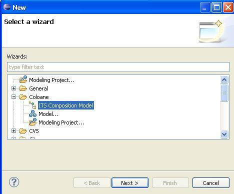
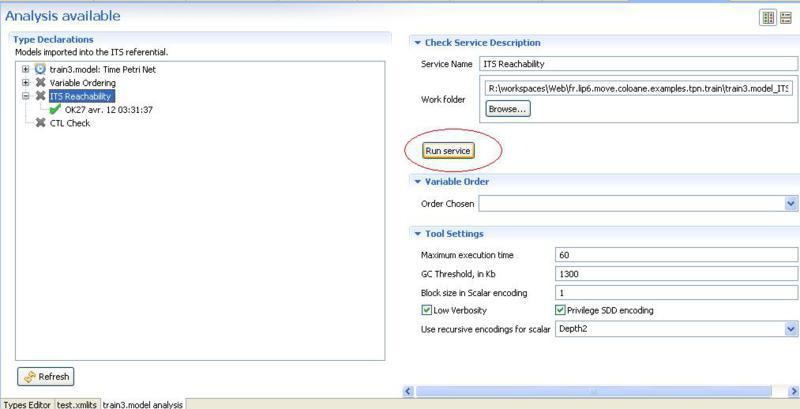
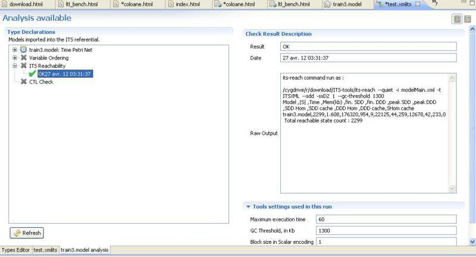
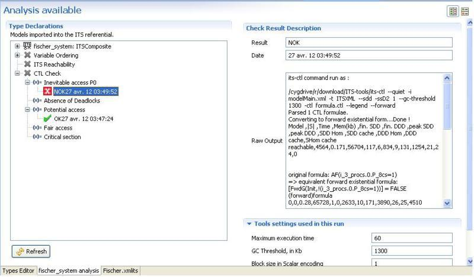

<html>
<?php include 'header.md'; ?>

<h1>Using ITS modeler to analyze ITS systems.</h1>

	The ITS Modeler front-end for its-tools can be used to analyze models 
	built using ITS Modeler with the its-tools.

<?php TableOfContents(__FILE__, 4); ?>

<h2>I. Install </h2>

Please follow [these guidelines](itstools.md#sec:modinst) to install ITS modeler.

<h2>II. Analyzing models</h2>

<h3>1. Reachability</h3>

To analyze models, we first need to create an ITS adapter that
	will wrap the Time Petri nets into instantiable transition systems.

Create a "File->New->Other->Coloane->ITS Composition model",
	Next, give it a name, Finish.

From the explorer on the left drag and drop the model(s) you wish
	to analyze into the "Types Declaration" frame (you can use multi
	selection). Then specify the various parameter bindings (variables of
	TPN models, type bindings of composite ITS models) as explained above.

Finally, select the model you want to analyze (usually the
	top-level model, with an empty offered interface, the full system
	composition), then click the "Analysis" button, which will setup a new
	tab in the same pane (switch between tabs at bottom of window).

You can now use the ITS reach service for instance: select "ITS
	reachability" then "Run Service"

You should get a service report that indicates some statistics on
	number of reachable states.

<h3>2. CTL</h3>

For the CTL service, I'll use examples from the Fischer example.
	You can get this model by "File->New->Example->Coloane->Fischer's
	Mutual exclusion" .

In the analysis tab, select "CTL check" "then "Add a formula"

Write a CTL formula, then select "Run service" you will obtain
	true/false results for your formulas.

<!-- #EndEditable -->
<?php include 'footer.md'; ?>

</html>
