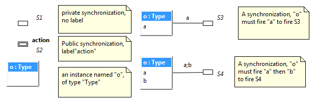
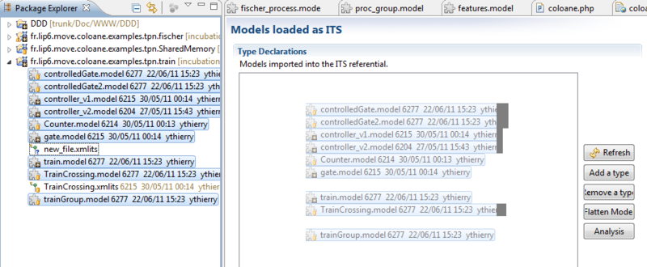
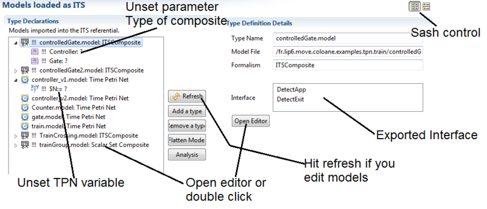
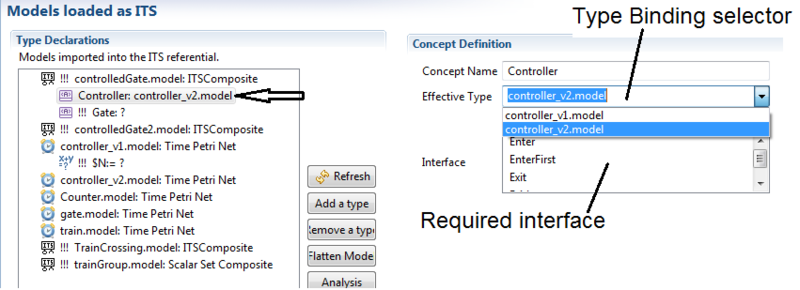
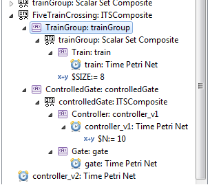
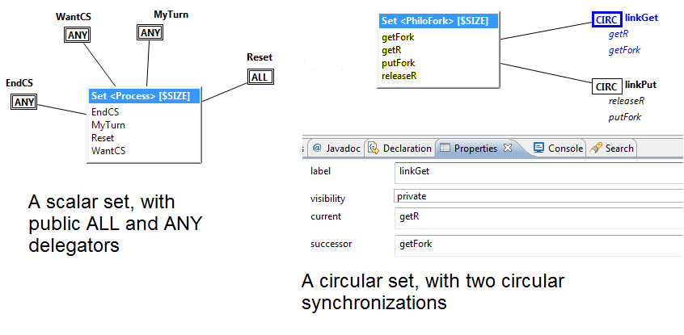

# Graphical Composite ITS

The ITS Modeler front-end for its-tools can be used to model and analyze ITS compositions of systems wrapped into ITS, such as GAL, Time Petri nets or other compositions hierarchically.

This page presents a semi-graphical DSL, expressing roughly the same concepts as the [textual Composite](cgal.md) language integrated in GAL.
This DSL was developed before the textual syntax, and is well integrated with the time Petri net editor and supports compositions of 
heterogeneous components (e.g. GAL + Petri nets). 

It also supports the Scalar and Circular compositions (that GAL does not currently have), that can yield extremely efficient solutions in the [SDD](libddd.html) engine.
Another feature not (yet) available in GAL is late type binding, allowing some nice model reuse scenarios.   

## Install

Please follow [these guidelines](eclipsestart.md) to install ITS modeler.

## Graphical Composite ITS editor

### Composite ITS formalism

To create a new Composite model : "New->Other...->Coloane->Model", select the "ITS Composite" formalism, and provide a name. 
Note that we want the "Model" entry not the "ITS composition" which allows to prepare analysis.

The features available for modeling are the following :

1.  Synchronization :
    *   Name : a name for the synchronization, not semantic but may be used in traces. Try to give a different name to each synchronization.
    *   Label : a label for this synchronization, exported as the public label of this action. 
    This label is semantic, if it is left empty the synchronization is local otherwise the synchronization can only fire if triggered externally by a
     synchronization targeting this label. 
     Labeled synchronizations are represented with a double edge, like public TPN transitions. 
     When several synchronizations "s_1,..s_N" bear the same public label "l", asking this composite to fire "l" requires ANY ONE OF the "s_i" to fire.
2.  Instance :
    *   Name : a name for this instance, used to name the nested variables used in the logic. 
    A variable "P1" of an instance "o" is accessed by the notation "o.P1" when queried in the logic. 
    The instance name is otherwise irrelevant, but each instance of a Composite should have a different name.
    *   Type : a string that denotes an abstract type for this instance. 
    This type name does not need to correspond to any existing type, it is just a placeholder for a concrete type that will be specified separately. 
    It thus defines a parameter for the enclosing Composite type, that will be fixed to an appropriate value prior to a given verification run. 
    If several instances of a composite use the same Type name, this only produces one configuration parameter for the composite type.
3.  Edges between instance and synchronization : Synchronization part. These edges are not oriented and bear a list of labels. 
A given synchronization can connect to many instances, but only one synchronization part should connect a given synchronization and a given instance.
    *   labels : a list of labels, that are added to the actions of the connected synchronization. 
    These labels should be separated by semicolons ";". 
    The semantics of using several labels on a synchronization part is sequential composition of the corresponding actions.
    *   When defining labels on synchronization parts, the connected instance is automatically updated to show its "required interface",
     i.e. the list of public labels a given type must define. All labels on synchronization parts must exist in the connected type.

For a more formal description of the formalism itself, these [slides from CompoNet'2011](files/CompoNet-2011-prez.pdf) 
and [the related paper](http://ceur-ws.org/Vol-726/04-componet-2.pdf)are a good source. Basically the semantics is given as a partial synchronization function à la Arnold-Nivat.

You can also browse the Examples in "File->New->Example->Coloane" to see several commented models that use the Composite formalism.

### Binding types to instances

To bind a concrete type to an instance, you need to build an "ITS composition model" that will allow to wrap the specification into the ITS framework.

We are going to explain how to do this using the "Train Crossing" example of the distribution. Obtain it by "File->New->Example->Coloane->Train Crossing"

There already is an ITS composition model, but let us build a second one, step by step. Select "File->New->Other->Coloane->ITS Composition model" and give it a name.

Then import all the models (.model) of your project into the ITS type referential, by multi-selecting (with ctrl-click and/or shift-click)
 the models and then drag and drop the group into the "Types Declaration" frame.

If you select the newly imported models, you will see for each one its exported interface, i.e. the set of public labels it declares if any. 
You can also open any of the models by double-clicking it, or by selecting the "Open Editor" button. 

Note that after modifying the actual models, you should save them, then select the "Refresh" button to ensure synchronization between this interface and the actual models. 
Observe for instance that "controller_v1" and "controller_v2" while being different TPN, both offer the same public interface.

If you select the "Controller" child of the "ControlledGate" model, you will see the required interface of this type, 
i.e. the set of action labels the bound type must offer. 
By clicking the "Effective Type", you can choose to bind a type you have imported in the referential to this Composite model. 
The "Type binding" drop list only proposes compatible types, whose offered interface is a superset of the required interface. 
When you have bound all the types, the composite definition is fully realized. The tree browser on the left helps to explore the children of a composition.

The "TrainCrossing.xmlits" composition model presents several possible assemblies of a full system.

## Using the Scalar Set ITS editor

### Scalar and Circular Set ITS formalism

Similarly to above, create a new Circular Set Composite model : "New->Other...->Coloane->Model", select the "Circular Set Composite" formalism,
 and provide a name. 
 The Circular Set and Scalar Set are very similar, but Circular has the additional concept of circular synchronization to connect "adjacent" instances in a ring topology.

The features available for modeling are the following :

1.  Instance (set of) : there should be only ONE instance node in each model. It represents a set of instances of a given type.
    *   Type : a string that denotes an abstract type for the instances in this set. This type name does not need to correspond to any existing type, 
    it is just a placeholder for a concrete type that will be specified separately, in the ITS composition editor.
    *   Name : there is no name field in an instance set definition. The nested instances are accessed in the logic using integers from 0 to "size-1".
    *   Size : The size of the set is specified as an attribute of the model rather than the instance, simply click anywhere on the background to see the "size" property. 
    This integer allows to determine how many instances are connected. The default value of size is the integer expression "$SIZE" allowing to delay the specification of
     the size until you want a given verification run.
2.  Delegator : a symmetric synchronization of the instances in the set.
    *   Label : a label for this delegator, that is both the label of this acton if it is declared public, and the label of the action
     invoked on the instances of the set. Delegator labels are added to the required interface of the contained type.
    *   Visibility : either Public or Private. Private transitions do not export their label, and may be fired any time they are locally enabled. 
    Public delegators cannot be fired unless triggered by an outside synchronization, that targets the appropriate label. 
    Public delegators are graphically represented with a double border. When several synchronizations bear the same public label "l", asking 
    this TPN to fire "l" requires ANY ONE OF the transitions labeld "l" to fire.
    *   Kind : either ANY or ALL. Firing an ANY delegator with label "a" forces ONE OF the contained 
    instances to fire action "a". Firing an ALL delegator with label "a" forces ALL instances to synchronously fire action "a".
3.  Arcs : an arc should connect each delegator or circular synchronization to the set of instances. 
This arc bears no labels, and is introduced mostly by homogeneity with the Composite formalism. 
The tool expects an arc to be there, disconnected synchronizations are a modeling mistake..
4.  Circular Synchronization :
    *   Label : a label for this circular synchronization, that is the label of this acton if it is declared public. Otherwise the label is not semantic.
    *   Visibility : either Public or Private. See above explanation for delegators.
    *   Current, Successor : these fields may contain a semi-column separated list of action labels. The interpretation is that to fire
     the circular synchronization, for any "i" in `[0, size-1]`, instance with index "i" must fire the sequence of labels in "current", and instance with index "(i+1)
      modulo size" must fire the sequence of labels in "succ". Labels mentioned in either of these fields are added to the nested type's required interface.

For a more formal description of the formalism itself, these [slides from CompoNet'2011](files/CompoNet-2011-prez.pdf) and
 [the related paper](http://ceur-ws.org/Vol-726/04-componet-2.pdf)are a good source. 
 Basically the semantics is given as a partial synchronization function à la Arnold-Nivat.

You can also browse the Examples in "File->New->Example->Coloane" to see several commented models that use the Composite formalism.

### Binding types to instances

Binding of a concrete type to an instance, and of a size to a scalar or circular set is accomplished similarly to binding a type of a composite. 
Please [refer to section "binding parameters to variables"](composite.md#ssec:bind) for more details.

