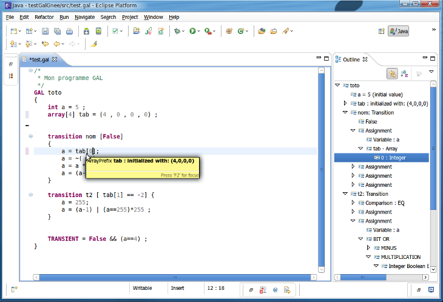
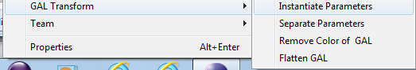

# GAL : Guarded Action Language

You will find here documentation for the Guarded Action Language, including its syntax and a description of the features of the model-checker built into the ITS modeler front-end.

GAL is a language providing a C-like syntax to describe concurrent systems. We provide a feature-rich editor and full CTL and LTL model-checking of GAL using the its-tools.

## 1\. Install

Please follow [these guidelines](eclipsestart.md) to install ITS modeler.

Once ITS Modeler is installed, create a new GAL model like this:
File → New → File → Coloane → Gal file...

Or simply "New → File" and give it a .gal extension, in any existing project.

These [GAL examples](files/gal.zip) translated from the BEEM distribution can help get started as well.

## 2\. GAL overview

This page presents the concrete syntax of GAL, please read [this document](./files/gal.pdf) for a more formal overview of GAL semantics and some of their applications.

### 2.1 An example GAL system

Here is an example of a system written in GAL:

<pre class='brush: gal;' >

</pre>





This code shows the main elements of the GAL language. A GAL system contains variable declarations and (possibly labeled)transitions that have a guard and an action that is a sequence of assignments.

GAL have a simple concurrent semantic, given as a labeled Kripke structure. A state is defined as a valuation of the variables. Any transition whose guard is true in the current state can be fired yielding a (set of) successor(s) obtained by executing each assignment of the transition in sequence. This interleaving semantic is adapted to modeling of concurrent systems. Semantics for interleaving of GAL transitions are similar to semantics of Petri nets. The effect of each transition is atomic, i.e. reachable states are those obtained after each computing all effects of the transition (modulo the transient state definition) that allows to skip some states)

### 2.2 What is GAL ?

GAL is an acronym for **Guarded Action Language,** a modelling language dedicated to the description of data manipulation for formal verification of concurrent systems. Although GAL can be used to directly model systems, it is a quite low-level modeling language, there are no explicit notions of process, struct, channels... However the semantics of these features can be expressed using GAL (although channels will need to have a maximum size), since the language is quite expressive in spite of its simplicity. GAL are meant to be a back-end language for more comfortable notations (Divine, Promela, Petri nets...) adapted to a given domain, or alternatively they can be seen as a high-level front-end to symbolically express transition relations for the ITS-tools symbolic engine.

### 2.3 What is its purpose ?

GAL is a semantic assembly language suited to formal verification, using symbolic methods (such as Data Decision Diagrams). GAL offer a high level of expressivity (manipulation of integer expressions, integers, etc...) but have simple semantics and an intuitive syntax. GAL are meant to be used as an intermediate language for modeling concurrent systems for verification by model-checking, and can be manipulated symbolically with good efficiency using decision diagrams and more specifically the ITS tools.

The typical use case involves defining a model transformation from your own notation to GAL to obtain a semantic definition of your system. This transformation can be implemented in several ways, but EMF artifacts are provided for GAL so Java/Eclipse users that have a metamodel of their DSL can leverage existing model transformation frameworks such as ATL or Epsilon. Alternatively, since the syntax is not too complex (e.g. not XML based!), a direct model to text translation can produce GAL models relatively easily.

## 3 GAL concepts

### 3.1 Systems in GAL

GAL files are simply text files with the extension .gal . For example, foo.gal is a valid GAL filename. Each file defines a single GAL system.

#### a) System declaration

A GAL system is characterized by a name, and contains a sequence of declarations (variables, transitions) that will be detailed throughout this document.

We designate by GAL system the model itself.

A GAL system is declared with the keyword gal, followed by the system name. The name must start with a letter of the alphabet and should be a C-style identifier (only using letters, underscore and numbers). A good practice is to give a meaningful name to the system created, particularly if it will be reused in a Composite ITS definition.

The body (variable and transitions) of the system name are then placed between a pair of braces.

Here is a declaration of an example GAL system named _emptySystem_.





#### b) System parameters

A GAL system declaration can optionally declare one or more _system parameters_. A system parameter essentially declares a symbolic name for an integer constant, that can then be used within the various instructions of the GAL system (including initializations, typedef, guards, statements...). Parameter names start with a $ sign to avoid any confusion with the variables of the system. Parameters are given a value directly after their declaration. Note that within the context of composite ITS, parameters can be given a value (different from the value given in the parameter declaration) when instantiating the GAL, thus simulating a kind of parametric constructor for the GAL.

Syntactically, parameters are given as a parenthesized comma separated list, just after the name of the system. Only integers may be used in parameter initializations.





### 3.2 Variable declarations

A GAL model declares variables. The variables manipulated in GAL can be integers or arrays of integer. There are no dedicated Boolean or char basic types, nor struct declarations. Integers are C-style signed integers, 32 bit (4 bytes) wide, with the same overflow semantics as in C ( (231 -1) + 1 = - 231).

In this section, we describe how variables of a GAL are declared.

Plain integer variables are introduced with the keyword int followed by the variable name starting with a letter. The variable name may contain alphanumeric characters as well as the "." character (which may help trace structs from of your source language if you are using GAL as a transformation target), The name must be unique, and cannot be reused for another variable. Each variable MUST be initialized, this is done using the "=" symbol followed by the initial value of this variable. The initial value can be expressed using an integer expression built of constants and/or type parameters, but it cannot refer to other variables. The declaration ends with a semicolon.

Below is an example of a system with two GAL variable declarations :





### 3.3 Array declarations

An array declaration allows to declare a fixed size array of integers. Like simple integer variables, each entry in the array needs to be initialized.

A GAL array variable is declared using the keyword array followed by the array size N within square brackets, then the array name. Each cell of the array MUST be initialized, to this end, a list of N comma separated integers surrounded by parenthesis (or integer expressions of constants and/or type parameters) should be provided. A semicolon end the array declaration.

Here is an example of a system with a declaration of an array:





### 3.4 Parameter type definitions

A parameter type definition allows to define a symbolic name for a given range of integers from min to max. These type definitions are used when declaring transition parameters. They allow to define a set of similar transitions in a compact and readable manner.

Syntactically, a type definition is introduced with the keyword typedef followed by a unique name for this type, followed by the actual range specification in the form "= min..max;". min and max are integer expressions built from type parameters and constants only.

Here is an example of a system with some parameter type definitions:





### 3.5 Transitions

#### a) Transition declaration

Transitions allow to step atomically from a source state to a (set of) successor state(s). Transitions are enabled by a guard, which is a Boolean expression and may carry a label that is a string. If the guard is true in the current state, the transition can be fired, executing all the actions it contains in sequence. Actions can be assignments, calls to a label or other statements as described below. Labeled actions _cannot be fired_ if they are not called from another transition or synchronized externally (see ITS composite). Transitions without a label are "private" and can be fired any time their guard is true, with interleaving semantics. A self-contained GAL (not intended for further composition) typically bears no labels on transitions.

Syntactically, a transition is declared with the keyword transition, followed by a unique identifier for the transition. The transition guard (a Boolean expression) is surrounded by brackets (that can be "true" if the transition is always enabled). The transition can optionally be labeled, as introduced with the keyword label followed by double quoted string defining the label. Finally the statements comprising the transition body are placed in a block surrounded by curly braces.

This example system contains two transitions of which one is labeled :



 



#### b) Transition parameters

Transitions can optionally define one or more parameters that allow a more concise and readable representation of a complex transition relation. Parameters have a type that is defined as a range of integers, introduced at the system level using a **typedef**. Semantically, each parameter can be replaced in the transition effects by each of the possible values in its type, producing several alternative transitions from a single transition that bears parameters.

Syntactically, transition parameters are declared in a parenthesized comma separated list just after the transition name, with a syntax reminiscent of arguments for a function or method. Each parameter is defined by giving its type followed by the parameter name which must start with a $ sign and cannot shadow a type (sytem level) parameter name.

This example, already used above when discussing type parameters:





Is equivalent to this version that does not use parameter definitions. :





### 3.6 Expressions

GAL expressions can be either integer expressions or Boolean expressions, depending on the context. We give here the syntax of these expressions, which is mostly directly taken from C (or Java). Usual priorities between operators are observed (e.g. Boolean AND stronger than OR, integer multiplication stronger than addition). In doubt, parenthesis can be used to force an evaluation order.

#### a) Integer expressions

**Binary**

| Operation | Operator |
| bitwise OR | '|' |
| bitwise XOR | ^ |
| bitwise AND | & |
| Left shift | < < |
| Right shift | > > |
| Addition | + |
| Subtraction | - |
| Multiplication | * |
| Modulo | % |
| Division | / |
| Power | ** |

**Unary**

| Operation | Operator |
| Unary minus | - |
| Bitwise complement | ~ |

Terminal integer expressions are simply references to plain integer variables, the cell of an array, or to a parameter. When accessing a cell of an array tab[index], the index expression is itself an arbitrarily complex integer expression.

System parameters (introduced just after the name of the system) can be used anywhere in the specification. Transition parameters (introduced just after the name of the transition) have the transition body as scope.

#### b) Boolean expressions

Boolean expressions are allowed in guards of transitions. It is also possible to write arithmetic expressions, with boolean appearance (as in C), which will be worth 1 or 0 depending on whether they are true or false (see Wrapper)

The basic expressions are true for « true » and false for « false ».

The usual boolean operators are present in GAL, such as OR (noted || ), AND (noted && ) and NOT( noted ! ).

Basic Boolean expressions can be any kind of comparison of two integer expressions.

| Operation | Operator |
| Greater than | > |
| Lesser than | < |
| Greater or equal | >= |
| Lesser or equal | <= |
| Equals | == |
| Not equal | != |

#### c) Wrapper of boolean expressions

Boolean expressions can be raised to integer expressions with the interpretation 1 for true and 0 for false, by surrounding the Boolean expression with parenthesis. This encapsulation of Boolean expressions as integers enables many (programming/modeling) tricks commonly encountered in C.

Note that the reverse is not possible, in particular, assignments cannot be nested within Boolean conditions, they do not return a value like in C. Hence all Boolean expressions are by construction side-effect free.

`Example : myVariable = (a == 0) * 100 ;_//myVariable is 100 or 0_`

### 3.7 Statements

Statements are operations that generally update the state of the system variables. The most common type of statement is the assignment of an integer expression on system variables to a system variable. Other statements include the call to a label, if-then-else conditional expressions, the abort instruction...

#### a) Assignments

Assignments are composed of a left-hand side (lhs), that must be a reference to a variable or to the cell of an array, and a right-hand side (rhs) that is an integer expression. When the lhs is a reference to an array, the target index within the array can be expressed using an arbitrarily complex integer expression.

#### b) Call action

The call action allows to call a label of the current GAL system, i.e. non-deterministically choose any of the enabled transitions that bear this label, and execute its actions. This powerful mechanism allows to model much more concisely when the transition relation carries non-determinism.

For instance, a transition that non deterministically assigns a value between 0 and N to two variables X and Y can be represented as containing two calls to labels "assignX" and "assignY". We can then build N transitions tX0, tX1... (resp. tY0, tY1...) bearing label "assignX" (resp. "assignY"), each of them with a [true] guard and a single assignment of a value to the designated variable. We thus accurately represent the transition relation with 2N+1 transitions rather than N^2 transitions.

Calls can also be used to simulate some control structures. For instance, If-Then-Else(cond, actif, actelse) can be simulated by two transitions bearing label "ite", with guards cond and not cond respectively, and body actif and actelse respectively. Calling label "ite" in a transition body is like executing an if-then-else block. Note that the whole ITS semantics is defined using sets, i.e. the successor relation returns a set of successors. Hence if no labeled action is enabled in some states at the point of call, no successors are produced, canceling the effect of the calling the enclosing transition for the concerned states, like an abort action.

Syntactically, a call is introduced by the keyword self, followed by a column '.', followed by a label between double quotes.

This example shows a use of a call to non deterministically update a variable.





#### c) If-Then-Else action

To ease modeling, GAL provide the if-then-else alternative control structure. As mentioned above this behavior can also be implemented using calls.

The semantics are those you could expect, if the condition is true the "if" block is executed, otherwise the "else" block is executed (or nothing is done if there is no else block).

The syntax is taken from C or Java, if followed by a Boolean condition between parenthesis, followed by a block between curly braces. Optionally, the statement can be completed by an else followed by a second block of actions.

This example shows a use of an if then else to invert the value of a Boolean variable.





#### d) For loop action

To ease modeling, GAL provide a constrained For loop iterative control structure. This mechanism is close to macro expansion, the loop is unfolded before analysis is performed.

A for loop defines a local parameter which has as scope the body of the loop. Since the domain of the parameter is is both known and finite, the loop can be simply unrolled.

The syntax reminiscent of Java foreach loop, for followed by $forparam : paramType between parenthesis, followed by a block (the loop body) between curly braces.

This example shows a use of a for loop to set values in an array.





It is strictly equivalent to this version.





#### e) Abort action

The semantics of GAL (based on ITS definitions) allow a statement to return a set of successors, since GAL natively support non-determinism. The abort statement returns the empty set of successors, hence it interrupts the current transition which then yields no successors.

The abort statement is mainly used to model transition relations where Boolean conditions with side effects need to be represented. It allows to have a transition with a guard, a few statements then typically an if-then-else or a variant using a call, of which some branches may encounter abort and cancel the transition effect for this branch.

The following example shows a use of abort to model the transition relation of a Time Petri net with two places a and b, and a transition t that moves tokens from a to b, with earliest firing time $eft and latest firing time $lft. Time cannot elapse if an enabled transition has reached its latest firing time, but this test is complex, particularly when there are many transitions. Use of abort allows to concisely represent the semantics.





#### f) Fixpoint action

The fixpoint action allows to apply a given sequence of statements until convergence is obtained. Note that this is convergence of the set of successor states, i.e. fixpoint returns a set of states such that applying the body of the fixpoint statement to this set yields the set itself. This operator is similar to Kleene-star closure of langage theory. It can be used to simulate mu (least fixpoint) and nu (greatest fixpoint) operators of [modal mu-calculi](https://en.wikipedia.org/wiki/Modal_%CE%BC-calculus).

The fixpoint statement is a powerfult tool to create abstractions of a state-space while preserving some target properties. The effects can be similar to the transient predicate, of which it is a kind of dual since Transient is expressed over states rather than over statements. It can be used to accelerate over "uninteresting" states for instance.

The following example shows use of a fixpoint to model the transition relation of a Time Petri net with two places a and b, and a transition t that moves tokens from a to b, with earliest firing time $eft and latest firing time $lft. In this version of the example, we wish to use as successor relation : from a source state s, find all states that can be reached from s by letting time elapse, then fire any enabled discrete transition of the TPN from these states. This abstraction originally proposed by Popova is called "essential states" and preserves marking reachability and branching time temporal properties. It is based on the fact that a transition cannot be disabled in a TPN by letting time elapse.

The example implements a least fixpoint using elapse. The transition "id" allows to keep currently reached states in the fixpoint. if it were removed, the transition relation would become : from a source state s, let time elapse as much as possible, then fire any enabled discrete transition of the TPN from this state. This definition of the transition relation would not preserve many properties of the original system. If we had other transitions in the system, they would all bear label "succ". This example system has only two states : the initial one (a=1,b=0,clock=0) and the state just after firing t (a=0,b=1,t=0).





### 3.8 Transient predicate

TRANSIENT is a keyword that modifies the semantics of a GAL system to accelerate over states satisfying the Transient predicate. When the transient predicate is false (which is the default assumption if no transient predicate is provided), the basic semantics where transitions produce successors in one step is used. However, any state that satisfies the transient predicate will be abstracted away and replaced by its successors by any enabled transition. The transition relation succ becomes : ( notTransient + succ o transient ) * . In other words, states satisfying the transient predicate are not considered part of the final state space, they are simply intermediate steps where another transition should be fired immediately. A limitation of this mechanism is that cycles of transient states (zeno style behavior) are considered ill-formed, and typically may cause the model-checking procedure to livelock. It is also an error if the initial state satisfies the transient predicate.

Transient is a kind of dual of the fixpoint below; supposing that all transitions of the system bear the label "succ", the statement:
fixpoint { if (transient) { self."succ" ; } }
reflects the semantics of the Transient predicate.

The transient predicate is declared with the keyword TRANSIENT, followed by the assignment sign =, followed by a Boolean expression.

This system only has two states, the initial one and the state where i=0 and tab = (0,1,2,3). Intermediate steps of this initialization loop are abstracted away in the semantics of the underlying transition system.





## 4\. GAL Editor features

The Eclipse plugin GAL inherits the editing features of the Eclipse IDE and this eases modeling of concurrent systems.

One of the interesting features of Eclipse is the well-known auto-completion. By pressing CTRL + SPACE, GAL provides a list of elements which may complement the word according to the characters written, or otherwise the elements that can be placed where the cursor is located.

On-the-fly syntax and some semantic validation are also proposed. Errors are raised in the editor for various common modeling issues such as name conflicts, cycles of calls, visibility issues, etc...

The outline view provides an abstract overview of the GAL system.

The formatter allows to indent and otherwise edit whitespaces to make the input look nicer. It can be accessed through a right-click->format, or with the key combination Ctrl-Shift-F.

Templates are proposed to build a new system or transition, accessed through ctrl-space. Some quick-fix actions are also defined to correct name conflicts for instance.

## 5\. GAL transformations

### 5.1 Invocation

When the GAL plugin is deployed, a right click on a folder or file will offer the "GAL transformation" menu.

Because the ITS-tools are currently unaware of system or transition parameters, these need to be instantiated before invoking the model-checking procedure. Such a process is a GAL transformation.

The Gal transformation menu currently contains four entries :

*   Instantiate parameters : this is the naive approach where the Cartesian product of all possible parameter values is considered for transition parameters. It can be quite explosive if the parameters have large ranges, but it is the baseline operation that needs to be run before calling the model-checker.
*   Flatten model : this is a much more efficient approach to instantiating parameters, where dependencies between parameters are computed and parameters are first separated as much as is possible to avoid building a number of transitions proportional to the Cartesian product of all parameters. In most cases this is the transformation you should use before model-checking.
*   Separate parameters : this transformation instantiates system parameters but preserves transition parameters. It is an intermediate step that produces a model with size linear to the input model, hence there is no explosion in model size to fear. In favorable cases, when parameters are not strongly dependent on each other, it splits transition effects into effects directed by each parameter, then calls the labels of these new transitions. This mechanism can be very effective when the transition relation has a lot of non-determinism. This transformation is incomplete since transition parameters still need to be instantiated, and is provided to allow the user to more easily trace what is happening in the steps leading to analysis.
*   Remove Color : this transformation simplifies arrays to basic integer variables, with value the sum of the array's cells. All accesses to the array are simplified to designate the new variable. This transformation is similar to removing color of a colored Petri net, it produces a simpler model whose behavior in terms of traces is an overapproximation of the original model. This feature has been used for colored Petri nets transformed to GAL, but it is still a beta.

### 5.2 Parameter Instantiation

Parameter instantiation consists in applying the following steps, in this order:

1.  All type level parameters (symbolic constants) are replaced by their value in all expressions.
2.  "For" loops are unrolled, i.e. the statement is replaced by n occurrences of the body statement, where the loop variable is replaced by its value in each of these occurences. The unrolling of loops is done first on nested statements.
3.  Transition parameters are then instantiated. Each transition that has parameters can produce several transitions. Suppose transition has parameters $p1,..$pk in domains D1,..DK (see typedef keyword). We first instantiate $p1 giving |D1| transitions, in which $p1 is substituted by one of the values in D1\. More precisely, any occurrence of $p1 is replaced by its numeric value, in the guard, label, and in the transition body (where the parameter $p1 may occur in calls to a label). Each occurrence of the transition has a new name allowing traceability. On the fly, the guard of the newly created transitions is simplified, and no transition is produced if it happens to be false. This can skip construction of many transitions in some examples. Because we do this iteratively and test after each parameter instantitation if the transition is false, the number of "skipped transitions" reported in the verbose trace can thus be smaller than the difference between the cartesian product of domain sizes and the number of transitions actually produced.

We then apply simplifications, currently we do the following rather trivial simplifications:

1.  Arithmetic and Boolean simplifications, on all constant expressions. Thus we replace (2 + 2) by (4), we also apply basic absorbing (0 * x -> 0, false && x -> false, true || x -> true) and neutral element (1 * x -> x, false || x -> x, true && x-> x) simplifications.
2.  We replace calls to non existing labels by an abort statement. These can occur as a result of other transition simplifications.
3.  We replace any sequence of statements containing an abort by a single abort statement. We destroy any transition with abort as body.
4.  Transitions with a false guard are destroyed.
5.  if (c) { s1 } else { s2 } is replaced by s1 if c can be reduced to true or to s2 if c can be reduced to false.
6.  Constant variables are identified and simplified away. To do this, we first track all write accesses to variables or arrays. Initially, all variables and array cells are supposed constant. We then scan all write access (assignments) in the specification. If a variable is assigned to, it isn't a constant. A write access to a single cell of an array (tab[3]) means this cell is not constant. A write access to an array using an index expression (tab[i]) discards the whole array. Variables that are actually constant can then be replaced by their intial values in the whole specification. Simple constant variables and arrays that are entirely constant are then removed from the state signature, i.e. they are totally discarded. TODO : Because we do not trace this effect beyond reporting in the verbose trace, the fact some variables disappear can lead to some confusion from the user, we need to improve this traceability.
7.  If we can find within a sequence of statements increments and/or decrements of a variable, and that they are commutative with statements that separate them, we fuse their effects. If the total effect is to leave the variable unchanged, the idle statement x=x+0 is removed. This can occur for instance with test-arc behavior in Petri nets.
8.  If two transitions that bear a label called only once and are identical in effects up to renaming of self, label and parameters, they are fused and only one of them is kept. This makes the specification slightly more compact, but is redundant with simplifications that occur in the model-checking engine. This reduction is called "fusion of isomorphic effects".

### 5.3 Parameter Separation

Parameter separation consists in rewriting conjunction of choices (as expressed by transitions with several parameters) to sequence of choices where possible.

Degeneralizing parametric transitions that bear a large number of parameters can produce very large GAL specifications. In general, degeneralization produces as many transitions as the size of the cartesian product of the domains of the formal parameters. But in many case, the full combinatorial unfolding can be avoided, allowing a compact transition representation while preserving semantics.

A transition has two independent parameters if it contains no statement that uses both parameters. Such a transition can be split into two labelled sub-transitions, one for each parameter, the semantics being preserved by calling the labels of these two sub-transitions. Statements are moved to the appropriate sub-transitions depending on the parameter they rely on. We thus obtain three transitions: the modified original one, that calls the sub-transitions and has no more parameter, and the sub-transitions, each of which has a single parameter. If the domain sizes of both parameters are called $r_1$ and $r_2$, we obtain after the instantiation of the parameters $r_1 + r_2 + 1$ transitions instead of $r1 \times r_2$. Thanks to the sequence and call statements, the semantics is preserved.

More generally, the detection of the parameters to be separated in a given transition is done by building an hypergraph, whose nodes are parameters and where an hyperedge is added for each statement, connecting together all the parameters used in it. We then consider the connectivity graph between parameters induced by this hypergraph. If a parameter $p$ has no neighbor, it can be separated: a new transition with parameter $p$ and a new label $l_p$ is built, whose body is the sequence of statements that depend on $p$. These statements are replaced in the original transition by a call the label $l_p$. Similarly, a parameter $p_1$ that has a single neighbor $p_2$ can also be separated. We similarly build a transition with the statements depending upon $p_1$ alone or $p_1$ and $p_2$. This transition bears both parameters $p_1$ and $p_2$, and is labelled with a new label $l_{p_2}$. Parameter $p_1$ can then be removed from the original transition, and the relevant statements be replaced by a call to label $l_{p_2}$. The procedure can be iterated on the simplified original transition, where $p_2$ may now be separable too. Instantiation will also instantiate $p_2$ in $l_{p_2}$, so as to ensure consistency for the values of $p_2$ across the separated transitions.

This procedure has low complexity, depending on the size of the parametric GAL. It is applied before instantiation of the parameters. Relying on the distributivity between sequential and parallel composition, it helps producing transition relation expressed as sequences of parallel compositions, yielding much more compact representations than an expanded parallel composition of sequences (such as used by LTSmin). This factored representation would not be efficient without the ability of symbolic operations to deal with parallel composition natively. One may see this transform as a manner of delaying the computation of the combinatorial number of instantiations until symbolic evaluation time, where the symbolic data structures help with the combinatorics.

This example transition of a colored Petri net taken from [this VendingMachine example](http://mcc.lip6.fr/pdf/DrinkVendingMachine-form.pdf) of the 
[Model checking contest at Petri nets](http://mcc.lip6.fr) shows how this reduction works in practice.

This is an extract of the [full model](galfiles/drink-vending-2-col.gal). Before separation, we have many independent parameters. In fact here all parameters are independent, since no statement simultaneously uses two parameters. Furthermore parameters $o1 $o2 and $o3 play a very symmetric role.





After separation (and fusion of isomorphic effects on $o1 $o2 and $o3) we obtain the following model :





This model when instantiated is still compact as shown here. Compare to what a [plain instantiation ](galfiles/vendingsimple.inst.gal) obtains; obviously when applicable this approach helps to scale as it can avoid exponential blowups in specification size.



](http://mcc.lip6.fr)

### 5.4 Hotbit transformation

When the specification contains hotbit variables or arrays they are rewritten as plain variables.

GAL supports the so-called hotbit encoding of variables with finite domain. It consists of an unfolding of the variable into one Boolean variable per value in the domain of the variable. This encoding is recommended for relatively small, and a priori known, domains, as it may increase locality.

It is a known features of BDD and DD in general: the classical binary encoding of a variable with $\log(n)$ bits creates strong (and somewhat artificial) dependencies between those bits, strongly hindering locality (think of the carry propagation after an increment). Although it implies more boolean variables, the hotbit encoding with $n$ bits can be much more effective, especially when $n$ is small, and the use of the variable not related of arithmetic. We have identified two main use cases: when an integer variable represents the state of a process, or some kind of process identifier.

In the former case, the variable is only assigned constant values. With a hotbit encoding, it means a reset of the current $1$ bit to $0$, and setting to $1$ the bit corresponding to the assigned value. If the process manipulates different sets of variables when in different states, this encoding can strongly increase locality: the bit corresponding to a given state can be put closer to the corresponding set of variables. This can yield much more compact DD encodings in some cases. This participated in the success story of DD applied to Petri nets, since the hotbit encoding is the natural candidate for markings of safe Petri nets.

In the latter case, we typically have a variable shared between process from which they read or into which they read their ID. Using a hotbit encoding allows to place the variable representing “value is $i$� close to the variables manipulated by process $i$. It increases locality as previously, and can again yield much more efficient DD solutions. It increases the symmetry in the DD encoding of the state space and again can yield much more efficient DD solutions.

We further automatically identify and tag variables that could benefit from one-hot encoding: any variable that is only assigned constants (this allows to statically compute the range) and whose domain size is greater than a threshold (we use 8) is set by default to one-hot encoding.

The main difficulty to keep good locality properties is the reset of the current $1$-bit to $0$. If the position of the $1$-bit is unknown, all the bits must be tested, which should incur a strong synchronization between all the bits of the encoding. This issue can fortunately be avoided by the use of labelled transitions (one per bit) that are called from the resetting transition.

Such a variable, or array, is prefixed by the \emph{hotbit(range)} keyword. This example shows a simple hotbit variable.





This is the model resulting from the transformation.





Note that due to parameter separation and instantiation, the final specification is still quite small. This is the fully instantiated model, after parameter separation and instantiation.





In more details, this is the algorithm applied. We suppose here a hotbit array, the simpler integer variable case can be deduced by considering $i=0$. To replace an variable $tab$ by its $hotbit(r)$ encoding, for each transition $t$, we first find all accesses to the variable $tab[i]$.

For each unique $i$ index expression found,

*   for each read before a write of the form **tab[i]**, if it is the first read encountered, add a parameter _ptabi_ with range _r_ to _t_ and add a disjunction to the guard _tab[i * |r| + ptabi]==1_. In any case replace _tab[i]_ by _ptabi_ where it occurs.
*   for each write after a read replace the statement _tab[i] = e_ by the sequence _tab[i * |r| + ptabi]=0 ; tab[ i*|r| + e ] = 1_. This action is correct in this case and modifies only two bits of the representation.
*   for a write before (hence without) a read, replace _tab[i] = e_ by the sequence _call(reset.tabi) ; tab[i*|r| + e] = 1;_. Hence reset all bits representing _tab[i]_ then assign a single one. We add a transition with label _reset.tabi_, with a parameter _p_ of range _r_ and with body _tab[i*|r| + p]=0;_. This encoding of the reset affects all variables encoding tab[i] (since we don't know its current value), but the reset part of the action is likely to be shared between different transitions, and it is expressed as a sum of effects due to the parametric transition and label introduced.
*   reads after writes and successive writes to a hotbit variable within a single transition are currently not supported. We place a syntactic restriction on the specification to enforce this rule. Handling these cases would be possible but requires a lot of care in the general case (tracking values across assignments) and does not correspond to the usage patterns encountered for good hotbit variable candidates.

## Acknowledgements

The GAL editor plugin was initially developed as part of the M1 student project and subsequent internship of KOUADIO Yao Louis Stephane Armel, SELLOU Hakim and ABKA Faycal, made in the MoVe team (Modeling and Verification) of Laboratory of Computer Science at the University Pierre et Marie Curie (LIP6), in the year 2012, under the supervision of Yann Thierry-Mieg. The aim of the internship was to implement an Eclipse plugin that allows editing of GAL files. This plugin harnesses all the power of Eclipse, including auto-completion, or quick-fix.

To achieve the goals, we used Eclipse and Xtext ([http://www.eclipse.org/Xtext/](http://www.eclipse.org/Xtext/)), an Eclipse plugin that allows you to define grammars for languages dedicated to a specific domain (**D**omain **S**pecific **L**anguage) in all its aspects, and this in a comprehensive manner.

The GAL plugin was developed using collaborative development tools, such as SVN for version control (public depot available with login/pass "anonymous/anonymous" at [svn co https://projets-systeme.lip6.fr/svn/research/thierry/PSTL/GAL](https://projets-systeme.lip6.fr/svn/research/thierry/PSTL/GAL)), as well as a server for continuous integration ([TeamCity](http://teamcity-systeme.lip6.fr/)).

Essentially all developments since 2012 (metamodel updates, enhancements, rewritings...) are the work of Yann Thierry-Mieg.

