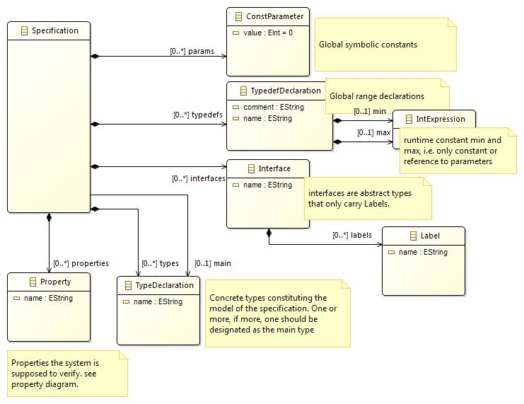
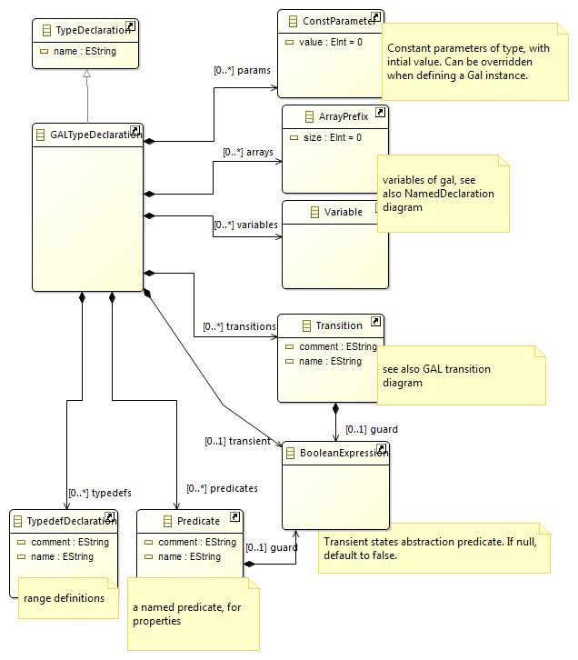
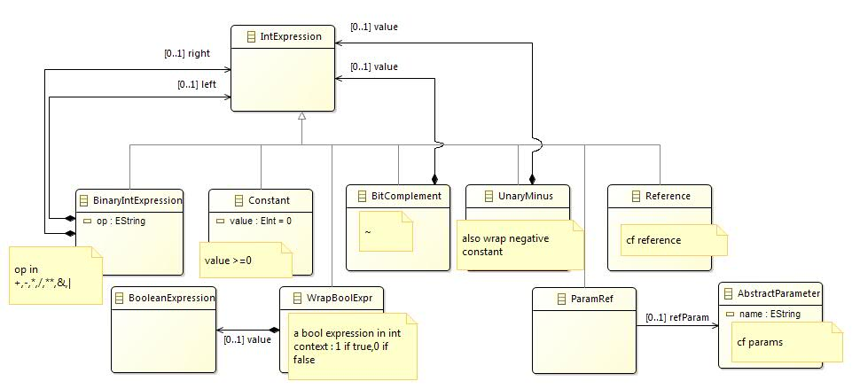
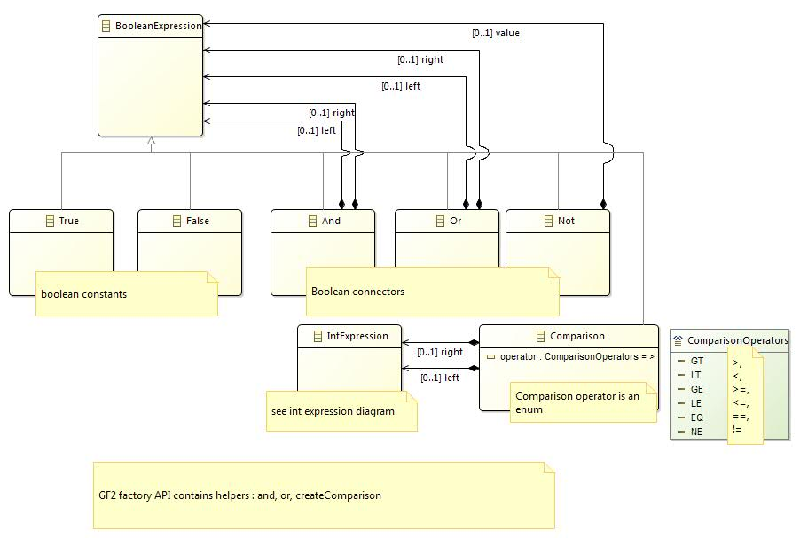
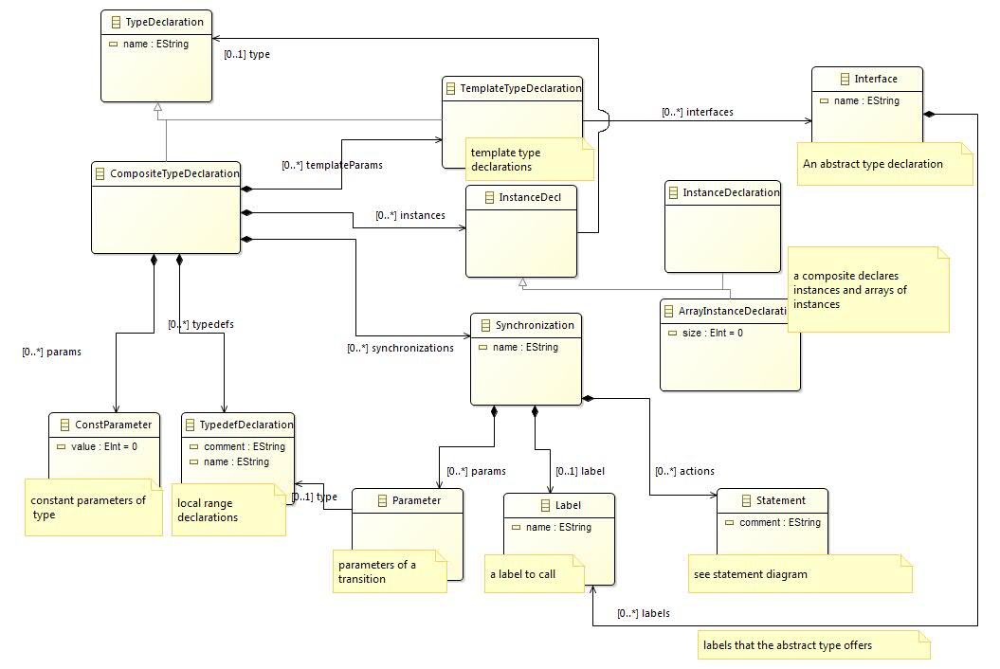
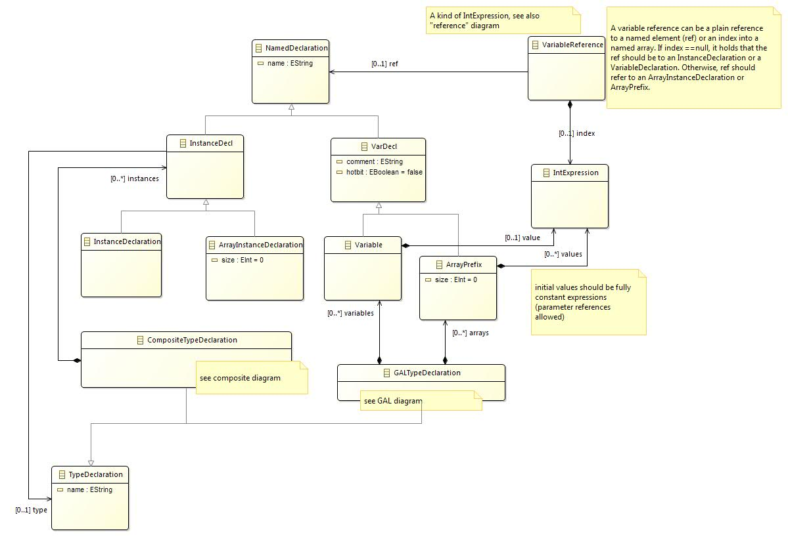
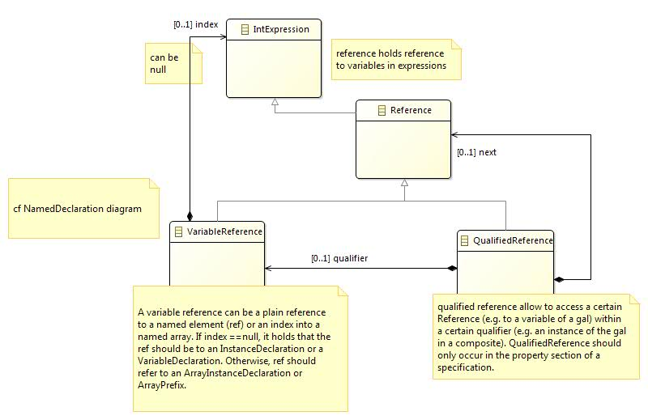
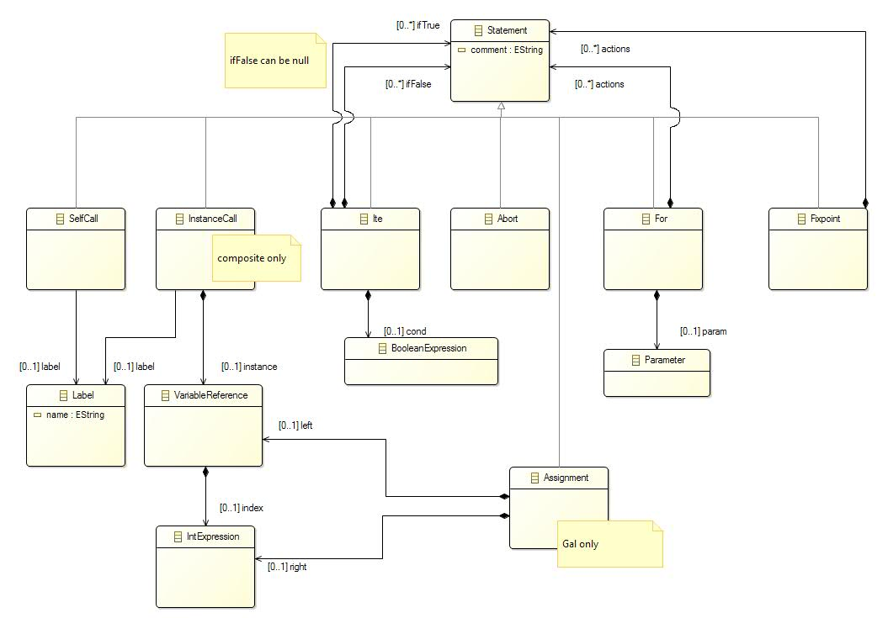
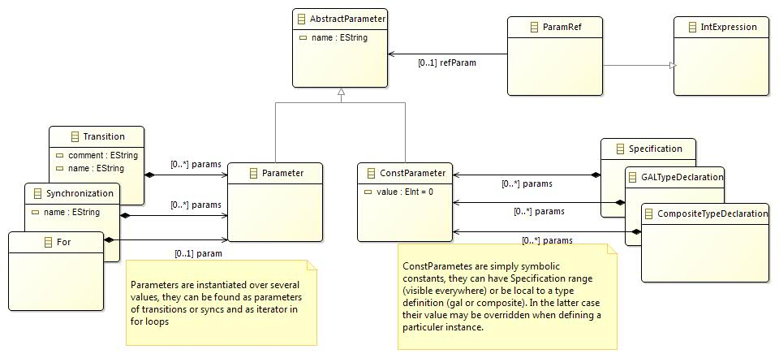

# Guarded Action Language Meta-model and grammar documentation

# GAL Metamodels

GAL is a DSL meant to express model semantics. As such it is meant to be the target of a model transformation process.

This page gives the technical details : it explains the concrete syntax (using an Xtext grammar) and the abstract syntax (using a meta-model).

## Install

For a developer, it is recommended to set up your eclipse as indicated [in the developer corner](devinstall.md) of the download page.

The **fr.lip6.move.gal** package hosts the full Xtext grammar (or you can [browse it here](https://github.com/lip6/ITSTools/blob/master/fr.lip6.move.gal/src/fr/lip6/move/Gal.xtext)

Please not that the grammar has a lot of redundancy, to provide better and faster parsing of models, but
this redundancy is not visible in the metamodel. In particular specific cases are made when parsing
expressions nested in properties, and constant expressions.

After executing the MWE2 workflow, the __ecore__ metamodel is found in model/generated folder. 
The model folder contains a __.aird__ file that hosts the diagrams presented in this page. 
You can open them natively using the EcoreTools plugin from standard eclipse download site.

## GAL overview

This page presents the concrete and abstract syntax of GAL, please read [this document](https://media.githubusercontent.com/media/lip6/ITSTools-web/master/files/gal.pdf) for a more formal overview of GAL semantics and some of their applications.

### Lexer Terminals

These are the terminal lexer tokens of GAL. ID is an Xtext predefined terminal that matches C identifiers. 
Many of our names support '.' in their definition, to help trace flattening of composite types to plain GAL. 
Parameters (which are runtime constants) are identified by a dollar sign. 
The its-tools command line parser cannot parse all of this grammar, many concepts (such as parameters) are simplified out before invoking the its-tools.

### Specification

 

A Specification is the root of a gal model. It holds types, of which one is the main, and properties. It can also define constant parameters (symbolic constants) and ranges, in any order. Interfaces are used in the template parameter type system.

### GAL type declaration

 

A GALTypeDeclaration mainly holds variables and arrays, and transitions. It can also define type parameters (that can be fixed at instantiation) as well as local range types. Predicates can be referred to by logic properties.

### Integer Expressions

 

### Boolean Expressions

 

### Composite type declaration

 

### Named declaration

 

### References

 

### Statements

 

### Parameters

 

## Acknowledgements

The GAL metamodel, xtext grammar, and this page are the work of Yann Thierry-Mieg. 
The initial metamodel/grammar of GAL was built during the internship (Master 1 2011) of KOUADIO Stephane, SELLOU Hakim and ABKA Faycal. 
Initial version of composite metamodel/grammar was built during internship (Master 1 2012) of CANTAIS Alexis and TRAN Marie-Diana.

