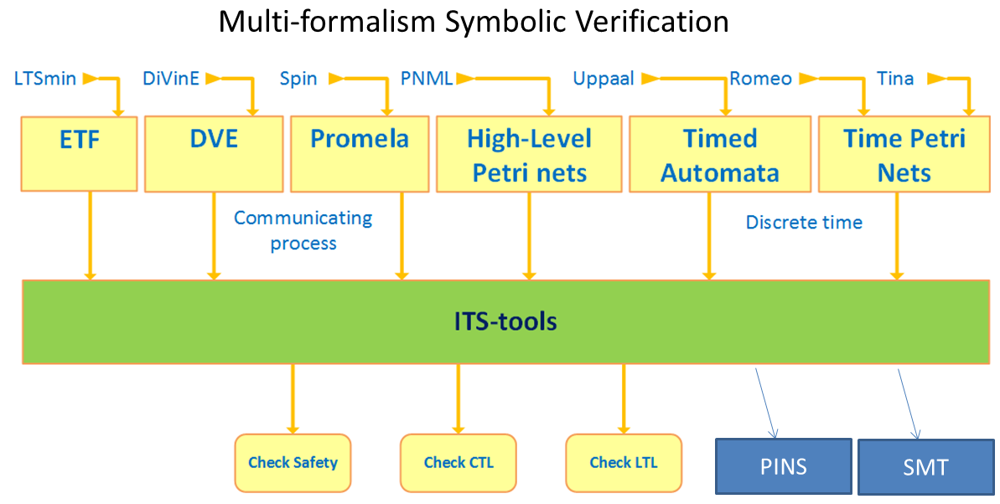
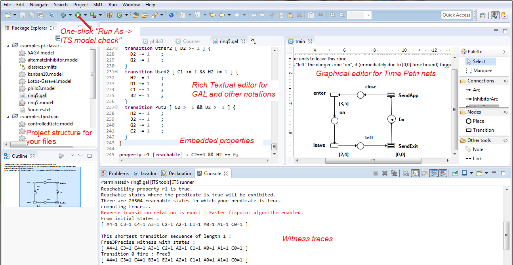
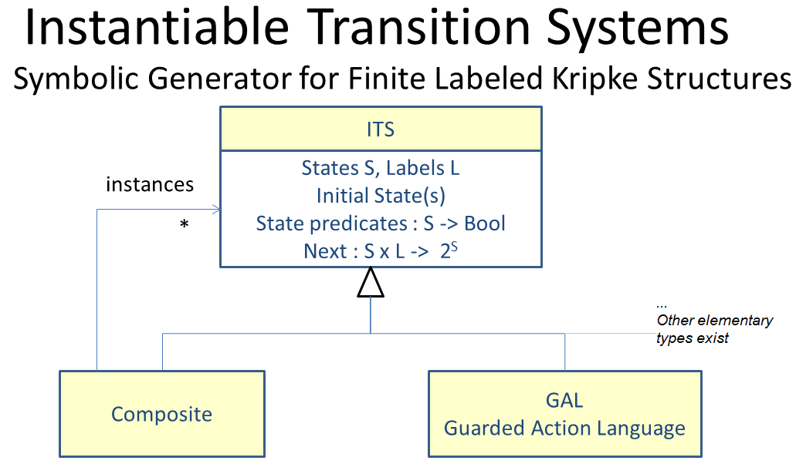
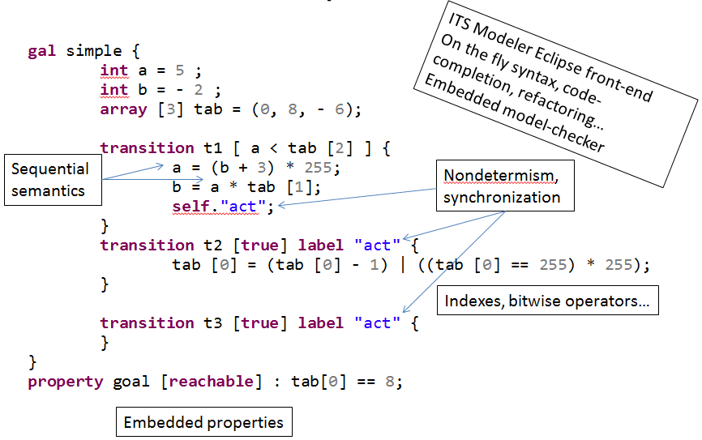

Welcome to [ITS-tools](itstools.md) Homepage
============================================

WARNING : these pages are work in progress, we are still migrating from [our older homepage](http://ddd.lip6.fr)

ITS-tools is an easy to use and powerful [award-winning](http://mcc.lip6.fr/2016/results.php) [model-checker](https://en.wikipedia.org/wiki/Model_checking) supporting Safety, 
[CTL](https://en.wikipedia.org/wiki/Computation_tree_logic) and [LTL](https://en.wikipedia.org/wiki/Linear_temporal_logic) 
properties for a variety of formalisms. It formally proves system correctness using exhaustive state space exploration.

Its architecture relies on an abstract contract for formalisms called Instantiable Transition Systems ITS that enables their semantic composition. An ITS is basically a [labeled Kripke Structure](https://en.wikipedia.org/wiki/Kripke_structure) but they can be _instantiated_ and composed (think [Composite DP](https://en.wikipedia.org/wiki/Composite_pattern)).

Our main concrete formalism is the [Guarded Action Language](gal.md) (GAL), featuring a simple yet user friendly C-like syntax.
It is very expressive and has simple interleaving semantics suitable for modeling concurrent systems of practically any kind.

Thanks to this central pivot and [model to model transformations](https://en.wikipedia.org/wiki/Model_transformation) that leverage [EMF](https://www.eclipse.org/modeling/emf/), we can support many commonly used [formalisms](formalisms.md) in other tools such as [Spin](http://spinroot.com) or [Uppaal](http://www.uppaal.org/). 

Our eclipse front-end offers rich textual editor (or graphical for Petri nets) for these formalisms.

If you'd prefer to use a command line tool, that is also possible using our
[pre-packaged ITS-tools for Windows, Linux or MacOS](https://yanntm.github.io/ITS-commandline/index.html).   

ITS-tools includes its own symbolic model-checker powered by [Hierarchical Set Decision Diagrams](libddd.md), but can also use an SMT solver such as [Yices](http://yices.csl.sri.com/) or [Z3](https://github.com/Z3Prover/z3) to perform 
[BMC](https://www.google.com/search?q=An+Analysis+of+SAT-based+Model+Checking+Techniques+in+an+industrial)/
[K-Induction](https://www.google.com/search?q=Checking+safety+properties+using+induction+and+a+SAT-solver), and export models with fine grain [partial order](https://en.wikipedia.org/wiki/Partial_order_reduction) analysis for use in the excellent multi-core  model-checker [LTSmin](http://fmt.cs.utwente.nl/tools/ltsmin/) that offers its own solution engines.

These varied solution engines, GAL simple syntax, and EMF support make GAL an attractive target in a process targeting verification of a [DSL](https://en.wikipedia.org/wiki/Domain-specific_language). 

Because we are dedicated to [FOSS](https://www.gnu.org/philosophy/open-source-misses-the-point.en.html) we use only free open-source  licenses, 
depending on files we use [EPL](https://www.eclipse.org/legal/epl-v10.html) and [APL](https://www.apache.org/licenses/LICENSE-2.0) for Java front-end,[GPL](https://www.gnu.org/licenses/gpl-3.0.en.html) for C++ tools using the kernel, [LGPL](https://www.gnu.org/licenses/lgpl-3.0.en.html) for the symbolic kernel libDDD.

Getting started 
---------------

We cover a few different scenarios here, if you're unsure just try the eclipse front-end.

[I want to use the eclipse front-end](eclipsestart.md)

[I want to use the command line only](itscl.md)

[I'm interested in contributing](devstart.md)

End user oriented documentation
-------------------------------

[GAL presentation and syntax](gal.md), see also [GAL meta-model](galmm.md) for more technical details.

Using the [composite formalism in GAL](cgal.md) files.

Using [parameters in GAL](pgal.md).

Writing [properties in GAL](properties.md) for invariants, reachability, bounds, CTL or LTL.

A quick guide on [Running the tool] and configuring its options.

[Working with Time Petri nets](tpn.md) (compatible with [Tina](http://projects.laas.fr/tina/), [Romeo](http://romeo.rts-software.org/))

[Working with Timed Automata.](ta.md)

[Working with DVE models.](dve.md)

[Working with Promela/Spin models.](promela.md)

[Working with LTSmin.](ltsmin.md)

Technical and research documentation
------------------------------------

[LibDDD our C++ library for Hierarchical Set Decision Diagrams.](libddd.md)

[LibITS our C++ library for symbolic model-checking of ITS and related tools.](libits.md)

[Choosing an LTL algorithm](ltl_bench.md)

[Scientific papers on the tool and its algorithms.](bib.md)

Citing
------

Please cite our [_Symbolic Model-Checking Using ITS-Tools_](https://link.springer.com/chapter/10.1007/978-3-662-46681-0_20) TACAS'15 paper if you are using the tool currently in your research, or a [more specific paper](bib.md) if you are referring to a specific technique we use. 

Reporting Issues
----------------

Please use the [Github integrated issues page](https://github.com/lip6/ITSTools/issues) to report issues you might encounter or [mail me](yann.thierry-mieg@lip6.fr) if you don't have a GitHub account.

Acknowledgments
---------------

Yann Thierry-Mieg is the main designer and author of these tools, with important contributions from colleagues and students. 
Maximilien Colange and Alexandre Hamez contributed to the symbolic kernel, as well as Jean-Michel Couvreur and Denis Poitrenaud who wrote the original libDDD. 
Much code was borrowed and adapted (hacked !) from open-source model-checking projects with friendly licenses, such as
 [LTSmin](http://fmt.cs.utwente.nl/tools/ltsmin/) and [VIS](http://vlsi.colorado.edu/~vis/), to which we are grateful.

We owe a lot also to the Eclipse project and its dedication to open source, we use a large number of FOSS plugins in our code base, notably EMF and XText.  

Much of the Eclipse front-end was prototyped during internships of students at Paris 6 University.

See acknowledgement sections at bottom of the various pages of this site for more detailed acknowledgments, as well as source history publicly visible on GitHub. 
