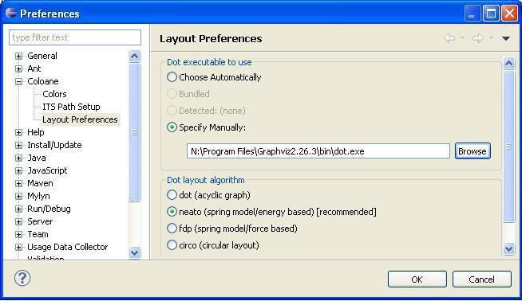

<html>
<?php include 'header.md'; ?>

<h1>Home of the libits library and its-tools.</h1>

<?php TableOfContents(__FILE__, 4); ?>

      
        <h2>What are ITS tools</h2>
        
libITS is a C++ library for model-checking of various formalisms using libDDD. 
        It defines instantiable transition systems (ITS), a simple labeled transition system semantics, in a symbolic way. The its-tools are built on top
        of libITS and support model-checking of ITS models.

        
Main features include:

        <ul>
          <li>Instantiable Transition System as a framework, allow hierarchical composition of components specified in diverse formalisms.
          </li>
          <li>Optimized implementation taking full advantage of the features of libDDD, notably automatic saturation and hierarchy.</li>
          <li>Support for Petri nets and some of their extensions</li>
          <li>Support for discrete time in models such as Time Petri nets and their compositions</li>
          <li>Support for GAL format input which offers rich data manipulation. </li>
          <li>Support for ETF format input which is produced by the tool LTSmin from diverse formalisms. </li>
          <li>Support for Divine format input which is native to the tool Divine and used in BEEM models. </li>
          <li>Support for CTL model checking using forward transition relation.</li>
          <li>Support for LTL model checking using some classic and some original algorithms that exploit saturation.</li>
        </ul>
        
The ITS tools are distributed under the terms of [GPL](http://www.gnu.org/licenses/gpl.html).

        <h2>I. What are ITS tools</h2>
        
libITS is C++ library for model-checking of various formalisms using libDDD.

        
Main features include:

        <ul>
          <li>Instantiable Transition System as a framework, allow hierarchical composition of components specified in diverse formalisms.
          </li>
          <li>User friendly GUI is provided as Eclipse plugins for modeling ITS compositions, (time) Petri nets, and rich-text editing of GAL models.</li>
          <li>Optimized implementation taking full advantage of the features of libDDD, notably automatic saturation and hierarchy.</li>
          <li>Support for Petri nets and some of their extensions</li>
          <li>Support for discrete time in models such as Time Petri nets and their compositions</li>
          <li>Support for GAL format input which offers rich data manipulation. </li>
          <li>Support for ETF format input which is produced by the tool LTSmin from diverse formalisms. </li>
          <li>Support for Divine format input which is native to the tool Divine and used in BEEM models. </li>
          <li>Support for CTL model checking using saturation and forward transition relation.</li>
          <li>Support for LTL model checking using some classic and some original algorithms that exploit saturation.</li>
        </ul>
        
The ITS tools are distributed under the terms of the GNU Public License [GPL](http://www.gnu.org/licenses/gpl.html).
		We have integrated modified versions of sources taken from other open-source projects such as Divine, VIS or LTSmin. See [Acknowledgements section](itstools.md#sec:ack).
		

        
&nbsp;

		
They are built using libDDD for
	model-checking of (labeled) Petri nets with some extensions (Time Petri nets,
	Queues, inhibitor arcs, rest arcs, self-modifying nets...), as well as
	their composition using a formalism called Instantiable Transition Systems.
	Composite ITS types offer a great flexibility in the definition of synchronized
	products of transitions systems. Scalar and Circular compositions  
    express common symmetric synchronization patterns (a pool of processes, a ring topology),
	and are exploited by the tool to provide superior performance. The GAL language
	complements ITS by providing a model for high-level data manipulation.
	It offers a rich C-like syntax and direct support for arithmetic and arrays.
	Systems can be provided using mixed formalisms, such as TPN for the control part
	and GAL for the data part synchronized using Composite ITS types. ITS-tools also
	support Divine models natively, thanks to an internal translation to GAL. Last
	but not least, ETF files produced by LTSmin from several high-level formalisms
	can be used as input for symbolic model-checking.
		

      <h2>II. Getting started </h2>

	  
There are three main use cases for the its toolset :  
	  <ul>
	  <li>As a model-checking supported design and modeling environment to model and analyze (small) systems (GAL, ITS, Time Petri Nets...)</li>
	  <li>As a model-checking command-line tool to analyze systems expressed in a compatible format (Divine, (Time) Petri Nets, generated ITS...)</li>
	  <li>As a support library for implementing efficient libddd enabled model-checking tools, or trying new symbolic algorithms, using concepts such as State and Transition encoded symbolically at a high level of abstraction.</li>
	  </ul>
	  

	
		These three use case are supported by different distributions of the ITS tools:
		<ul>
	  <li>For modeling and design, a set of eclipse plugins called "ITS Modeler" can be installed through an update site.
	  ITS Modeler allows graphical editing of Time Petri nets, ITS compositions, and GAL editing with on-the-fly error/quickfix mechanism. 
	  It also embeds the command-line tool (no separate download required) and offers a graphical front-end for the CTL tool (syntax, options, save formulae...).
	  The front-end also offers support for I/O of many other tools (Tina,Lola...) </li>
	  <li>The command-line tool is distributed as binaries for most platforms in three flavors supporting reachability, CTL and LTL properties. 
	  All tools share common input formats and most of their control options, such as -i [input_file] -t [Input format]. 
	  Input formats currently supported are : Divine .dve, ETF .etf, PROD .net, GAL .gal, ROMEO .xml, ITS .itsxml,.xml, CAMI .cami.
	  Reachability, CTL and LTL tools share a common syntax for state predicates.
	  Though manual interaction is feasible, this scenario is mainly adapted to users writing scripts to invoke the tool.
	  </li>
	  <li>For developers of symbolic algorithms, the sources are available through anonymous svn. libits is a C++ library that takes care of nasty 
	  I/O and low level encoding of states and transition relations for you, and lets you harness the power of homomorphisms and the fixpoint operator.
	  Based on libddd, the root class ITSModel offers the critical getNextRel(), getPredRel(),  getInitialState() and getPredicate()
	  that allow to write most model checking algorithms just using Identity, fixpoint and homomorphism compositions. Automatic homomorphism rewritings 
	  will take place transparently to enable efficient algorithms such as saturation where possible. The CTL and LTL sources
	  can be used as examples of how to use and link to the libits library. 
	  </li>
	  </ul>
	  
	Please use the table of contents to navigate to the scenario that fits you best.
	<ul>
	<li>[for ITS Modeler eclipse front-end](itstools.md#sec:modinst)
	</li><li>[for ITS tools command-line](itstools.md#sec:cldl)
	</li><li>[for source distributions of libits and related tools](itstools.md#sec:library)
	</li>
	</ul>
	
	

	<a href="#toc">Start of page </a>
	

	  
	  
	    <h2>III. Using ITS modeler</h2>
		
		<h3>1. Installation</h2>

		
The ITS modeler front-end user interface requires Eclipse.

		<h4>Step 1 : Download software</h4>

		
In newer releases (> Oct2012), provided your platform is supported (Darwin, Windows 64, Linux 32 or 64), the back-end model-checking
tools (its-reach, its-ctl and its-ltl) are downloaded and configured with the plugin.
Note that the linux binary version does require a recent glibc >= 2.14.
If you would like to use the ITS-tools as command-line tools without the front-end, please see [command line section.](#sec:command) 
You will need the following elements to successfully install the tool :

<h5>1. Eclipse</h5>

	Download a version of Eclipse for your platform from <a
		href="http://www.eclipse.org/downloads/">http://www.eclipse.org/downloads/</a>.

The "Eclipse IDE for Java Developers" version is fine. You can
	also use an existing eclipse if you prefer.   
	BUT we require a recent Eclipse Luna 4.4, due to dependencies on XText.

Download the archive, decompress it, and run eclipse.

<h5>2. (optional) GraphViz</h5>

Users of GAL and textual composite notations can skip this step.
  This package is optional, but really helps when manipulating
	large graphical models such as Petri nets. 
	It allows to layout large graphs.

	If you don't already have graphviz, download it from <a
		href="http://www.graphviz.org/Download.md">http://www.graphviz.org/Download.md</a>.
	It is sometimes already available (linux, MacOS), try the command "dot" at a command
	line to check.

<h4>Step 2 : Eclipse integration with ITS tools</h4>

<h5>1. Download the plugin</h5>

 NEW (March 1 2015): Our update site has moved (it used to be hosted by the Coloane project) ! Update your update site address !

Start Eclipse. To deploy the user interface plugin into eclipse,
	go into the menu : "Help->Install New Software..."

	In the "Work with" field, copy paste the following update site address
	:
	<url>http://ddd.lip6.fr/update-site</url>

Then select like on this screenshot

<ul>
	<li>The first category allows to install all the features with a single selection. If you are only interested in some packages, the second category allows to pick and choose what will be installed. </li>
</ul>

The other packages necessary for [GAL</a>,<a href="composite.md">ITS](gal.md) or <a href="coloane.md">Time Petri
	nets</a> will be resolved and downloaded automatically. Leave the "Contact all update sites" checkbox marked so necessary dependencies (xtext if not yet installed) will be downloaded automatically from the eclipse releases official update site.

You should leave the checkbox "contact all update sites" marked, as this will allow to resolve dependencies such as Xtext, EMF etc... on the eclipse standard update site. Please be a bit patient, eclipse updates are pretty slow.

 If you later want to update, the checkbox "contact all" can be left unchecked, this speeds install considerably.

 We are grateful to [JetBrains](http://www.jetbrains.com) and their open-source project support policy, that allows us to use the excellent
continuous integration server [Teamcity</a> (see our setup at <a href="http://teamcity-systeme.lip6.fr">teamcity-systeme.lip6.fr](http://www.jetbrains.com/teamcity/)).
This allows us to easily build, test and distribute these plugins for your convenience and ours.    

	

<h5>2. (optional) Configure Eclipse to use GraphViZ</h5>

This step allows to activate the layout tool, to automatically
	set positions of Petri net nodes or other graphs. This step is only necessary if "dot"
	at a command line does not work, i.e. "dot" is not on the PATH.

Inside eclipse, go to "Window Menu->Preferences" then open the
	category "Coloane -> Layout Preferences"

Use the "browse" button to find the "dot" executable in the "bin"
	subfolder of your GraphViz distribution.

Your preference screen should look like this :

<h5>Step 3 : Getting started</h5>

That's all, the tool is ready to run now.

At this stage you have a working Time Petri net editor, and
	import/export of Tina or Romeo models as well as the GAL feature rich code editor.

You can try to "File->New->Example->Fischer's Mutual exclusion"
	to get an example model.

Or create an empty "File->new Project->Coloane->Modeling
	Project", Next, give a name, finish.

	<a href="#toc">Start of page </a>

		<h3>2. Usage</h3>

		

 The ITS modeler front-end is ideal for casual users or teaching purposes.
We provide a graphical editor for discrete time Petri nets and the composite ITS formalisms.
It supports import/export from many additional formats of Petri nets (PNML, Lola, Tina, Prod, Coloane...).
The GAL language is supported by a feature rich text editor (syntax highlighting, error reporting on the fly, auto-completion, simulator/debugger...)
built on Xtext. Interaction with ITS model-checking tools is built-in, with a configuration wizard
allowing to easily experiment with variations on a model or model-checking options and record the results.
Example ITS models are also provided in the front-end.
 

		

		Usage of the front-end is discussed for the various formalisms available on separate pages.
		Use the entries on the sidebar (left of the page) to navigate to 
		[GAL</a>,<a href="composite.md">ITS Composite](gal.md) or <a href="coloane.md">Time Petri
		nets</a>  or [CTL/LTL](analysis.md)
		for help on the different aspects of ITS modeler.
		

		
		<h2>III. Using command line its-tools</h2>

		<h3>1. Features</h3>

		
 The its-tools distribution contains three separate programs. 
		All these tools take as input Instantiable Transition
		Systems. This general compositional semantic framework allows to define
		models in parts, and uses the powerful algorithms and data structures
		of libDDD for state space representation.

		
Different input formalisms and formats are supported, even within a given model, 
			provided they match the requirements of an ITS type definition : what is a symbolic set of states ? what is your symbolic transition relation ?. 

		
 With this semantic definition of the model, its-reach tests reachability of a given state, its-ctl checks whether the initial state satisfies a
		given branching time CTL property, and its-ltl checks linear-time temporal LTL properties of the language (set of infinite runs) of a system. 
		

		
		
		All three tools share common options for specifying the target ITS model, then each has a specific option to specify respectively the state to reach, the CTL property, or the LTL property.
		Additional options specific to each tool allow to refine the behavior (i.e. select a specific model-checking algorithm or strategy). 
		

		
The package libits includes a tool to compute reachable state space
		and answer reachability queries, called its-reach.

	its-ctl is a library and tool for CTL model-checking of Instantiable
	Transition Systems. It leverages on the ITS and SDD libraries and on a
	component for CTL formula manipulation taken from <a
		href="http://vlsi.colorado.edu/~vis/">VIS</a>.

	its-ctl is stable, it has been used notably in the <a
		href="https://projets-systeme.lip6.fr/trac/research/NEOPPOD/wiki/pnxdd">project
		Neoppod</a>. It currently supports the following features:

<ul>
	<li>ITS model input: any ITS model can be CTL checked.</li>
	<li>Forward model-checking using the past temporal logic operators.
		This feature is activated by default as it provides superior
		performance in practically all cases.</li>
	<li>Full witness/counter-example trace explanation.</li>
</ul>
 

its-ltl is a library and tool for LTL model-checking of Instantiable
	Transition Systems. It leverages on the ITS and SDD libraries and on
	the model-checking library Spot which handles translation of LTL
	formulae to TGBA a variant of Buchi automata. Spot does not compile
	easily on cygwin platform, so this tool is only available for linux and
	macosX. Features:

<ul>
	<li>ITS model input: any ITS model can be LTL checked.</li>
	<li>Two algorithms adapted to stuttering invariant properties for
		hybrid explicit/symbolic LTL\X model checking. Option -SSOG implements
		the Symbolic Observation Graph approach, and -SSOP is a new more
		efficient dynamic version of the same.</li>
	<li>One algorithm for hybrid explicit/symbolic full LTL model checking.
		Option -SSLAP implements a novel approach: the
		Symbolic Local Aggregation Product.</li>
	<li>Fully symbolic LTL checking using forward OWCTY or EL algorithms.</li>
</ul>

		
		<h3>1. Download</h3>

		<?php include 'tcaddresses.md'; ?>
		
		
		<h3>2. Usage</h3>

				
		
 If you just intend to use the tool at a command-line,
	run it with option "-h" to get a description of various options available.
	The Samples/ folder contains many examples, and the tests/ folder cover many common invocation idioms.
	Note that the command-line tool is meant for experts or back-end model-checking,
	and it is usually invoked through scripts on verified input or as generated by other tools.
		

		
		

		If you want to experiment using the command line tool on models edited with ITS modeler front-end, 
		just run any analysis on your model, a side effect is to generate input compatible with the command line tool in the current "work" folder.
		This is by default a subfolder of your eclipse project. Just run the tool with  "-i modelMain.xml -t ITSXML" to specify the input.
		

		
		<h4>2.1 Common options of its-tools </h4>

		Models can be given to its-tools as:
		<ul>
		<li>Extended ordinary Petri nets: place/transition nets with pre, post,
		inhibitor, and test arcs. Syntax of input files can be any of Romeo
		xml format, PROD format, CAMI format, CAMI+JSON. A clean programmer
		API designed to facilitate generation of (large) nets is also
		provided.</li>
	<li>Composite types and their variants, ScalarSet and CircularSet.
		These types offer a general support for the composition of ITS
		instances. A dedicated XML format (as generated from the Coloane ITS
		plugin) or a programmer API can be used to input Composite types.</li>
	<li>Discrete time models: Time Petri nets in the XML format of Romeo,
		and TimedComposite allow to build representations of timed models. TA
		support is currently in development.</li>
	<li>Models input in the <a
		href="http://fmt.cs.utwente.nl/tools/ltsmin/etf.html">ETF format</a>
		as produced by [LTSmin](http://fmt.cs.utwente.nl/tools/ltsmin/).
		This means we can analyze (CTL, LTL) the numerous formalisms that are
		seen as front-ends by LTSmin.
	</li>
	<li>Models input in the <a
		href="gal.md">GAL format</a>.
		With this rich format for data manipulation a wide class of systems can be described. 
	</li>
	<li>Models input in the <a
		href="http://divine.org">Divine format</a> by internal translation to GAL.
		This means we can analyze (CTL, LTL) divine models natively. Efficient ordering heuristics
		(based on GAL structure) are also provided. 
	</li>
	</ul>

	<h5>Input Options (mandatory):</h5>
    <ul>
	<li>-i path : specifies the path to the input model file. 
    </li>
	<li>
	-t {CAMI|PROD|ROMEO|ITSXML|ETF|DVE|GAL|DLL|NDLL} : specifies format of the input model file :
		<ul>
			<li>CAMI : CAMI format (for P/T nets) is the native Petri net format of [CPN-AMI](http://move.lip6.fr/software/CPNAMI/MANUAL_SERV/index.html)
            </li><li>PROD : PROD format (for P/T nets) is the native format of [PROD](http://www.tcs.hut.fi/Software/prod/)
            </li><li> ROMEO : an XML format (for Time Petri nets) that is the native format of [Romeo](http://romeo.rts-software.org/)
            </li><li> ITSXML : a native XML format (for ANY kind of ITS) for this tool. These files allow to point to other files and are used as main file for composite definitions. See [this example</a>, the list of formalism/format supported is described <a href="https://projets-systeme.lip6.fr/trac/research/libddd/browser/libits/trunk/src/ITSModelXMLLoader.cpp">here](https://projets-systeme.lip6.fr/trac/research/libddd/browser/libits/trunk/Samples/ITSXML/philo4/modelMain.xml). 
            </li><li> ETF : [Extended Table Format](http://fmt.cs.utwente.nl/tools/ltsmin/etf.html) is the native format used by LTSmin, built from many front-ends.
            </li><li> DVE : Divine is a modelling language similar to Promela. Input file should be in [Divine format](http://divine.fi.muni.cz/manual.html#quick-guide-the-dve-specification-language).
            </li><li> GAL : Guarded Action Language. Input file should be in [GAL syntax](gal.md).
            </li><li> DLL : use a dynamic library that provides a function "void loadModel (Model &,int)" typically written using the manipulation APIs. See demo/ folder.
            </li><li> NDLL : same as DLL, but expect input formatted as size:lib.so. See [demo/ folder](https://projets-systeme.lip6.fr/trac/research/libddd/browser/libits/trunk/demo/philoSumo.cpp) for a usage example. Both DLL and NDLL are used to inject of arbitrary C++ ITS types into the ITSModel.
			</li>
		</ul>
	</li>
	</ul>
	
	<h5>Options related to Variable Order</h5>

	
libits uses static variable orders. These options allow to view or modify the variable order used.

	
The syntax of a variable order file is a sequence of  : (on one line) : #TYPE [nameoftype]   followed by variable names one per line, followed by #ENDTYPE on a single line.
	A single ordering file may contain order of many ITS types. [An example order file.](https://projets-systeme.lip6.fr/trac/research/libddd/browser/libits/trunk/tests/test_models/train4.ord) See also the output of "--dump-order".
	

	
	<ul>
		<li>--load-order path : load the variable order from the file designated by path. This order file can be produced with --dump-order. Note this option is not exclusive of --json-order; the model is loaded as usual, then the provided order is applied a posteriori. 
		</li><li>--dump-order path : dump the currently used variable order to file designated by path and exit. 
		</li>
	</ul>
	
	
 Besides these general options valid for all ITS models, (time) Petri nets can be loaded with a hierarchical variable order in JSON format. See the
	[PNXDD](https://projets-systeme.lip6.fr/trac/research/NEOPPOD/wiki/Framekit_guide_stand_alone#a4HeuristicDescription) tool which embeds various heuristics that produce these files.
	A Petri net loaded with a hierarchical order is re-encoded internally as a composition of subnets. See [this March 2012 TopNoc paper](http://pagesperso-systeme.lip6.fr/Fabrice.Kordon/pdf/2012-toponc-pnxdd.pdf) that describes these heuristics in detail.
	 
	This option is Petri net specific:

    	
	<ul>
	<li>
	--json-order path : use a JSON encoded hierarchy description file for a Petri net model (CAMI, PROD or ROMEO), such as produced using Neoppod/PNXDD heuristic ordering tools. Note that this option modifies the way the model is loaded. 
	</li>
	</ul>
	
	

	For models that use GAL or Divine formalisms, we have adapted [Aloul et al's FORCE heuristic.](http://web.eecs.umich.edu/~karem/papers/Aloul-GLSVLSI03.pdf). 
	Use option --gen-order for fine control on these heuristics, or leave the default that is a good compromise for a broad range of models.
	

	<ul>
    <li>--gen-order L?Q?S? : Invoke ordering heuristic to compute a static ordering. Three types of constraints can be specified:
		<ul>
		<li>L   try to improve locality of transitions.
		</li><li>Q   try to reduce the number of queries.
		</li><li> S   try get the state variables higher in the structure.
		</li>
		</ul>
	</li>
	</ul>
     
  It defaults to LQ, a fair compromise between improving locality and reducing the need to query the lower part of the structure when resolving the actions.
       If you want to use the default (lexicographical) ordering, use --gen-order "" to deactivate all the constraints 

	
	<h5>Options related to Encoding of ITS types</h5>
	
	
For Petri nets, there is a choice between an SDD encoding,  where to each variable is associated the set of integer values it can take, or a DDD encoding, where each edge of the decision diagram is labeled by a single value (i.e. like MDD).
	The default used is the SDD encoding, but option --ddd sometimes works better when markings (or transition latest firing times) have large values.
	

	<ul>
    <li>--sdd : privilege SDD storage (Petri net models only).[DEFAULT]
    </li><li>--ddd : privilege DDD (no hierarchy) encoding (Petri net models only).
	</li>
	</ul>
	
	
 For Scalar and Circular symmetric composite types, the following options allow to use recursive state encodings.
	The default setting is "-ssD2 1", i.e. for a Scalar or Circular set of size n, define n SDD variables, one per subcomponent.

	<ul>
	<li>-ssD2 INT :[DEFAULT: -ssD2 1] (depth 2 levels) use 2 level depth for scalar sets. Integer provided defines level 2 block size. 
   </li><li>-ssDR INT : (depth recursive) use recursive encoding for scalar sets. Integer provided defines number of blocks at highest levels. 
    </li><li>-ssDS INT : (depth shallow recursive) use alternative recursive encoding for scalar sets. Integer provided defines number of blocks at lowest level. 
	</li>
	</ul>

	

	Default setting -ssD2 with block size of 1 for a system of size 9 produces encoding (P//P//P//P//P//P//P//P//P) .
	For instance, with -ssD2, if size is 9 and block size is 2, 5 variables are introduced, 4 of which represent the state of two subcomponents and one with a single subcomponent state.
	Hence encoding is : ((P//P)//(P//P)//(P//P)//(P//P)//(P)). 

	For instance, with -ssDR, if size is 9 and block size is 2, 2 variables representing the states of 4 and 5 subcomponents are introduced. 
	The 4 subcomponents are encoded as 2 subcomponents containing each 2 instances. The 5 subcomponents are encoded as 2 subsystems of 2 and 3 instances. etc...
	Hence encoding is : ((P//P)//(P//P))//((P//P)//((P//P)//(P))). 
	
	For a system of size 9, with -ssDR 4, the encoding is ((P//P)//(P//P)//(P//P)//(P//P//P)), with four variables at the outer level and 2 or 3 variables at internal level. 
	
	For the same example of size 9, with -ssDS 4, encoding is : ((P//P//P//P)//(P//P//P//P)//(P)), with 3 variables at outer level and 1 to 4 variables at internal level.
	

	
	

	A good approach to determine a good setting of these options for a particular model is to first try "-ssD2 1" and "-ssD2 2".
	If building blocks of size two reduces the complexity, higher values can be tried. Choosing values for -ssD2 above half the system size is not useful as these all provide the same encoding.

	

	If having larger block size helps, and the size of the system is large enough, try either -ssDR or -ssDS. Note that due to the form of the decomposition, results for different 
	values of block size may be irregular. An ideal case is when choosing a block size k is such that the system size n is a power of k. In that case, -ssDS and -ssDR provide the same encoding.
	Having k divide n is also a favorable case, as it helps build similar subsystems (same number of instances in each subsystem).
	

	

	For more details on this recursive encoding, see the [2011 ITS definition paper](http://ceur-ws.org/Vol-726/04-componet-2.pdf) where Scalar and Circular composite and their encodings  are defined (page 8-9).
	

	<h5>Options related to gc policy</h5>

	

	libddd has an optimistic garbage collection policy, where a memory threshold is set to start running the gc.
	Below this threshold, no gc will occur, trading faster runtimes for higher memory footprint.
	Above this threshold, at certain steps of the symbolic algorithms (when the data structures are in a stable intermediate step), the gc will be triggered.
	When invoking the gc, a new threshold is defined as the max of the previous threshold and the memory usage when invoking the gc.
	Use a very low value of the threshold to minimize the memory footprint, or leave the default at 1.3 Gb, that provides very fast results for small models, 
	but still allows to scale up on larger ones. Avoid setting the threshold above 60% of physical memory, as this may lead to swapping before the first gc call. 
	

	
 Garbage collection options :  
    <li>--no-garbage : disable garbage collection (may be faster, more memory)
    </li><li>--gc-threshold INT : set the threshold for first starting to do gc [DEFAULT:13000 kB=1.3GB]
	</li>
	

		
	<h5>Options related to saturation</h5>
	
	
 Two variants of saturation are possible, controlling how clusters are applied at a given level.
	The BFS variant chains application of each transition cluster using a round robin, while the DFS variant chains
	applications to a fixpoint of each cluster. The DFS variant can be very efficient when a given transition
	cluster can be fired several times in a row. This could be the case for a transition with a high level
	of non-determinism, or a transition such as "time elapses" which can often be chained without firing other transitions.
	Petri nets with large marking values also often exhibit this behavior where a transition can be fired several times in a row.
	

	
	

	The default setting is BFS, except if loading Time Petri nets where the default becomes DFS (more efficient in our experiments).
	Manually setting the strategy overrules these defaults.
	

	
	<ul>
	<li>--fixpoint {BFS,DFS} : this options controls which kind of saturation algorithm is applied. Both are variants of saturation not really full DFS or BFS. [default: BFS]
	</li>
	</ul>

	

	
<h4>2.1 Options specific to its-reach </h4>
	
	
 its-reach is a small tool that showcases the options available to configure libits.
	It allows
	<ul>
	<li> To compute statistics on the number of reachable states of a system using full or bounded depth exploration
	</li><li> To test a system for presence of deadlocks
	</li><li> To test reachability of a given predicate on state variables
	</ul>
	

	
	<h5>Options controlling the reachable set computation</h5>
	
	

	The default behavior of its-reach is to build the full state space (which is hopefully finite), using saturation.
	This behavior can be changed to force a bounded BFS exploration (i.e. bounded model-checking or bmc) of the state space over a given number of steps.
	<ul>
	<li>-bmc XXX : use limited depth BFS exploration, up to XXX (an integer) steps from initial state.
	</li>
	</ul>
	

	
	

	With option -reachable, the user can ask whether a state satisfying a given boolean predicate over variables is reachable.
	A predicate is a boolean composition using AND &&, OR ||, NOT ! and parenthesis () of comparisons of variables to constants.
	The predicate is tested on the states reached at the final iteration if -bmc was enabled, otherwise on the full reachable state space.
	Whitespace are semantic as they are included in variable names if present, so avoid any superfluous whitespace in the predicate expression.
	A shortest trace from initial state to a target state will be supplied if the state is reachable.
	<ul>
	<li>-reachable XXXX : test if there are reachable states that verify the provided boolean expression over variables
	</li>
	</ul>
	

	
	See [this page](https://projets-systeme.lip6.fr/trac/research/libddd/browser/libits/trunk/tests/tests.def) for invocation examples.

	
	
	<h2>IV. Using libits as a C++ library</h2>

	
	
	The first step is to download and build libddd from source, we recommend directly from svn, following [this procedure](libddd.md#sec:svn).
	Although we'll be generally happy to help you if encounter issues with the code, there is no "developer guide" yet.
	Doxygen documentation can however be generated giving some overview of the code.
	When looking at the source, we recommend you start from the central ITSModel referential class and at the ITS Type contract.
	

Note that to build from the svn, you need autotools and to invoke
	"autoreconf -vfi" to create the "configure" script. 
	Due to various dependencies, building from svn requires some configuration settings.
	Remember, configure --help is your friend, and you can also have a look at the configuration settings of our [continuous integration server](https://teamcity.rsr.lip6.fr/)
	for inspiration on how to invoke configure.

This is the recommended approach for developers to download the
	ITS related tools.

Full installation follows these guidelines:

<h3>1. Prerequisites</h3>

In addition to libddd prerequisites, tools built on top of the ITS library require:

<ul>
	<li>BOOST librairies for C++ (&gt;= 1.31). You can get it here <a
		href="http://www.boost.org/">Official Boost Home</a> or packaged in
		most linux distributions.
	</li>
	<li>libExpat : a lightweight C library to parse XML documents. You can
		get it here <a href="http://sourceforge.net/projects/expat/">Official
			LibExpat Home</a> or packaged in most linux distributions.
	</li>
	<li>Antlr : a parser generator. You can
		get it here <a href="http://antlr.org">Official
			ANTLR Home</a> or packaged in most linux distributions. Complete build
			of libITS from source requires full antlr distribution, but the "easy-install" script below takes
			care of obtaining this package during install using "wget".
	</li>

</ul>

To obtain and install ANTLR we provide this small script.
Then pass configure options "--with-antlrc="$tmp"/antlr-3.4-bin   --with-antlrjar="$tmp"/antlr-3.4-bin/antlr-3.4-complete.jar" to libits, ctl and ltl builds.

 
[Download as a shell script](files/antlr.sh)
 

<?php highlight_file("files/antlr.sh"); ?>

Finally LTL tools built on top of the ITS library and Spot library
	require:

<ul>
	<li>Spot LTL model-checking library. You can get it here <a
		href="http://spot.lip6.fr/">Official Spot Home</a> just follow the
		install instructions. 
	</li>
	<li>Python (&gt;= 2.0). This is a standard package on most
		distributions.</li>
</ul>

[Start of page ](#toc)

	
<h3>2. Source install of libITS</h3>
 
[Download as a shell script](files/libits.sh)
 

<?php highlight_file("files/libits.sh"); ?>

[Start of page ](#toc)

	
<h3> 3. Source install of ITS CTL checker</h3>

[Download as a shell script](files/ctlits.sh)
 
<?php highlight_file("files/ctlits.sh"); ?>

<h3>4. Source install of ITS LTL checker</h3>
 
[Download as a shell script](files/ltlits.sh)
 
<?php highlight_file("files/ltlits.sh"); ?>

<h2>VI. Acknowledgements </h2>

<h5>libits and its-reach</h5>

The code base for libITS is loosely based on the program called pnddd
	by Denis Poitrenaud and Jean-Michel Couvreur. The code for ITS
	manipulation is due to Yann Thierry-Mieg. Code for manipulation
	of GAL and Expressions was written by Yann Thierry-Mieg and Maximilien colange.
	Input parsers were contributed by Silien Hong (JSON) and Didier Lime (Romeo).  
	The code for manipulation of ETF files is heavily based on LTSmin, by Stefan
	Blom, Alfons Laarman, Elwin Pater, Jaco van de Pol, Michael Weber et
	al. of the Formal Methods and Tools group of the University of Twente
	(NL). Essentially a subset of the files of LTSmin managing ETF models
	are duplicated in the src/etf/ folder of libits, and some refactoring
	was performed to remove dependencies to things we do not use in this
	scenario. A first proof of concept implementation for interaction
	between SDD and LTSmin is due to Jeroen Ketema of Univ. Twente; this
	served as an early basis to build the ITS wrapper around ETF files.
	The code for handling parse of Divine models is directly extracted (and adapted) from the divine source distribution.
	Translation of Divine to GAL is loosely based on the code of a patch (divine compile -l) for divine provided
	by the Twente group.
	

<h5>its-ctl</h5>
	

 The code base for CTL-ITS is heavily based on the ctlp and mc
	components of VIS from Boulder University. See VIS: A system for
	Verification and Synthesis, <a href="http://vlsi.colorado.edu/~vis/">VIS
		homepage</a>. The ctlp package is due to Gary York, Ramin Hojati, Tom
	Shiple, Adnan Aziz, Yuji Kukimoto, Jae-Young Jang, In-Ho Moon. The mc
	package is due to Adnan Aziz, Tom Shiple, In-Ho Moon.  The code
	was reworked to remove the dependency on GLU/CUDD the decision diagram
	package they use (and have developped). The SDD/ITS code for CTL
	checking is due to Yann Thierry-Mieg, and Silien Hong.

<h5>its-ltl</h5>

The code base for LTL-ITS is loosely based on the tool checksog by
	Denis Poitrenaud and Kais Klai. Most of the current code base is due to
	Alexandre Duret-Lutz, Denis Poitrenaud, Yann Thierry-Mieg, and Kais
	Klai. Improvements and the new SCC decomposition based method were provided as patches
	by Etienne Renault. Maximilien Colange also contributed improvements to
	handling of Divine atomic propositions. Ala Eddine Bensalem contributed the
	whole TGTA functionality and algorithm. 

Unless otherwise indicated (see individual source file headers), all of the code base is the work of Yann Thierry-Mieg, UPMC, (c) 2002-2014.

	

[Start of page ](#toc)

<!-- #EndEditable -->
<?php include 'footer.md'; ?>
</html>
