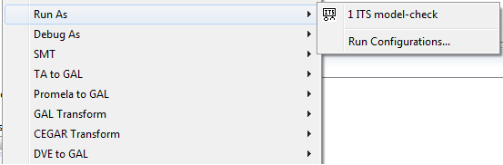
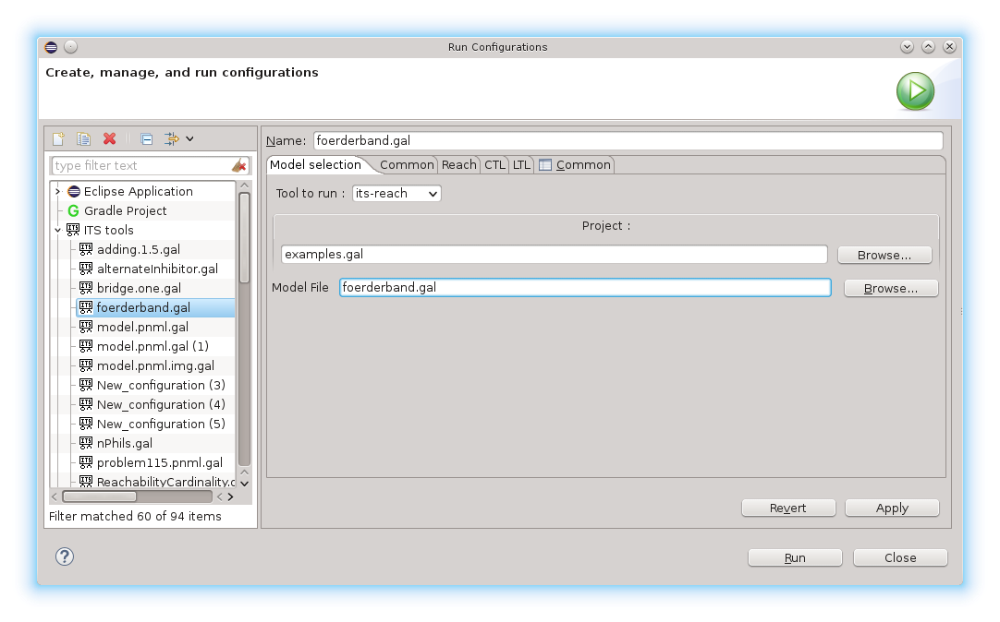

# Running ITS Tools from Eclipse

## Invoking the tool

This documentation explains how to invoke ITS Tools to perform model-checking of [GAL specifications](gal.md).

The main way to run the tool is simply to add [properties](properties.md) to your GAL files, then 
*right click* the GAL file and select "Run As..->ITS Model check".
  

This action will run ITS tools with the default settings if it's the first time, or with the last used settings if you have already 
run model-checking on this file.

## Configuration and Settings

Running for "ITS Model-Check" for the first time on a given file also adds an entry to the "Run" menu, accessed 
* using the small down arrow next to the big green "play" button,
* or through the top menu *Run* -> *Run Configurations*,
* or by right-click on a GAL file then *Run As* -> *Run Configurations...*

These run configurations are persistent across eclipse sessions. 
Each run configuration features several tabs, that help you configure ITS-tools.

### Configuration Tabs

In the main configuration tab, you can :
* Select which tool to run; you can check either all safety and bounds properties with _its-reach_, all CTL properties with _its-ctl_
or all LTL properties with _its-ltl_. Depending on your selection, only some of the other tabs are relevant.
* Select your project : this is the eclipse project holding your files
* Select your file : this should be a GAL file, possibly parametric, and usually containing [embedded properties](properties.md). 
Make sure the file has no syntax errors before running model-checking (just open the file, errors will be underlined in red).

Then you can edit settings on the Common tab (shared across all tools), and on the tab that
corresponds to your currently selected tool.

In each tab, you can float over the options to get some help on what the setting controls.

The settings appropriate for most use cases are discussed below. 

### Reachability

When you select "its-reach" tool, the *Reach* tab can be used to 
* Report statistics on the number of states, minimum and maximum values of variables, number of edges in the state graph
* Verify [safety and bounds properties](properties.md). 
	* Unless you check the "no witness" option, you will get a witness (guaranteed to be a *shortest* path)
	* A witness is a trace consisting of an initial situation, a sequence of transitions, and the final situation reached.
	* If you'd like to see intermediate states of the trace (not just the transitions), edit the setting "trace states" on the Common tab
* If analysis fails (e.g. system unbounded) you can try to explore it at a limited depth with the *bmc* option 

More information on [its-reach on its dedicated page](reach.md).

### CTL

When you select "its-ctl" tool, the *CTL* tab can be used to 
* Verify [CTL properties](properties.md). 
	* Unless you check the "witness" option, you will not get a witness
	* A witness is a composed of parts, corresponding to the syntactic tree of the input formula
	* Some witnesses are sequential traces (*EF* operator), some are one possible loop in an SCC (*EG* operator)
	* all traces reported are shortest paths, as for its-reach, use the "Common" tab to print states in traces
	* When boolean connectors are encountered, the counter example is further explained   	

Note that the formula is first translated to pure existential form, and also rewritten to perform forward
CTL when possible. To help interpretation of witness traces, activating the "backward" option removes some
 of these transformations, making the trace usually more readable. 

The fair-time setting is only useful if your model features discrete time, as indicated by a top level
label in the *main* instance called "elapse". Models obtained from [time Petri nets](tpn.md), or from
[timed automata](ta.md) have this feature. In those cases however, you usually do want to activate it,
it prevents witness traces that are abusing divergence on the time step and thus gives results
 similar to e.g. Romeo.
 
More information on [its-ctl on its dedicated page](ctl.md).

### LTL

When you select "its-ltl" tool, the *LTL* tab can be used to 
* Verify [LTL properties](properties.md). 
	* Witnesses are not very easy to read currently, you need to checkbox the various options to build dot files
	of the formula automaton and of the product to really understand it
	* Many strategies and algorithms are available; if the default SLAP-FST does not work, you might try
	the SOP (stuttering invariant only) or the FSOWCTY (fully symbolic) as the results of these methods are
	 generally incomparable (depending on the model and formula, some fail where the other succeeds)   	
   

More information on [its-ltl on its dedicated page](ltl.md) and on the page [choosing an LTL algorithm](ltl_bench.md)

## Further analysis

The traces are produced in a console in Eclipse.
The trace features at the top the command line invocation that was performed,
 and can be reproduced outside eclipse. You can also add [more flags and options](libits.md)
 on the command line than are currently features in the configuration tabs.
 
The command line invocation should work on all OS, it uses the binary tools that were 
packaged within the eclipse update site (and live in the plugins/ folder of your Eclipse).
 
However, the models are transformed a bit in the verification process, the actual command line
tools work on simpler targets featuring a reduced GAL syntax (e.g. no parameters, no embedded properties)
and get the properties from separate files with again a more restricted syntax (e.g. no whitespace, quoted atomic properties...)

These files are built in a *work/* folder created next to your input GAL file; hit F5 to refresh the
 parent folder to see them in the Eclipse browser.

If you'd like to run from the command line but using fully fleshed GAL files with all its features
we distribute a [command line package](itscl.md), though it is still in early development stage 
(please [ask us](https://github.com/lip6/ITSTools/issues) if you need some feature that exists in Eclipse
by clicking some menus, but not from the command line). 

