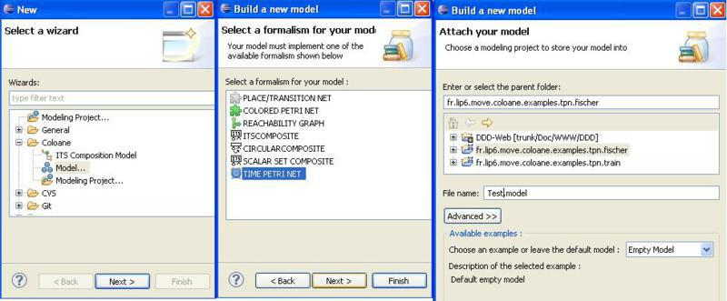
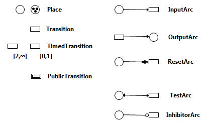
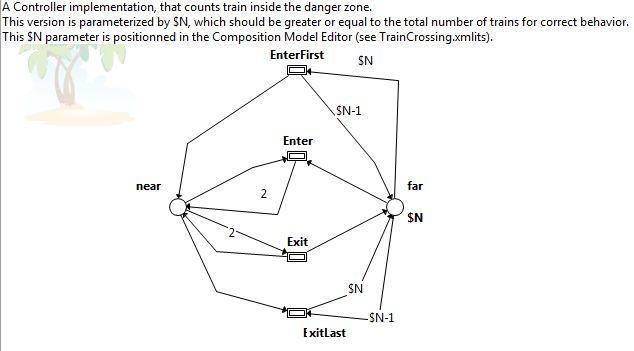
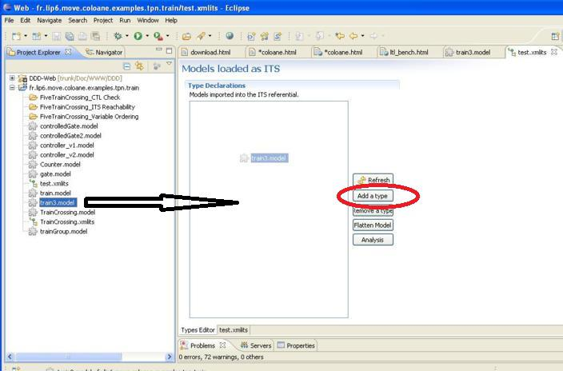
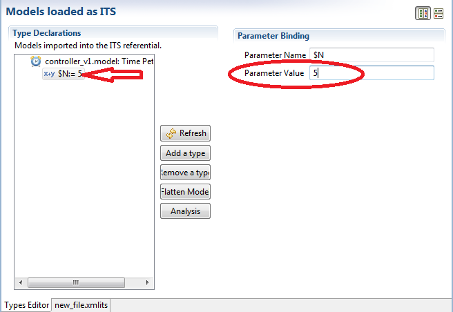
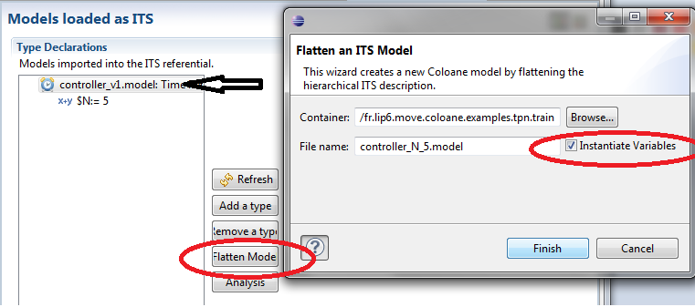
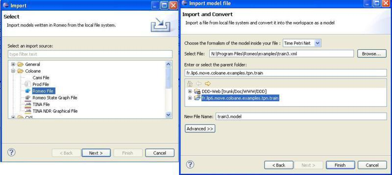

# Working with Time Petri Nets

The ITS Modeler front-end for its-tools can be used to analyze Time Petri nets, and some effort has been invested in providing a user-friendly
 GUI and compatibility with the major TPN tools [Tina](http://projects.laas.fr/tina/) and [Romeo](http://romeo.rts-software.org/). 
 ITS tools and the graphical front-end are available for all major platforms (Windows, MacOS X, linux).

## Install

Please follow [these guidelines](eclipsestart.md) to install ITS modeler.

A set of examples is provided embedded in the distribution. 
After install, use "New->Example...->Coloane Example->" and select any of the examples with a small clock designating Time Petri nets.

## Using the Time Petri net editor

### Modeling with Discrete Labeled TPN

Create an empty project: "File->new Project->Coloane->Modeling Project", Next, give a name, finish.

In this project create a new TPN model : "New->Other...->Coloane->Model", select the TPN formalism, and provide a name.

You can use the palette to create new objects. Just make sure you have the "Properties" view open, so you can edit names and attributes of the selected objects. 

The editor itself is feature rich thanks to Coloane, and supports all the usual cut/copy/paste, zoom, inflection points on arcs, 
guides and rulers to help align objects, graphical properties (color, size...) etc... 
There are quite a few keyboard shortcuts (Ctrl-C, Ctrl-V), toolbar buttons and right-click contextual actions available in the editor,
 which are not described in detail here. Float over the buttons to get a help tip. 
 

The formalism used is Discrete Time Labeled Petri Nets with inhibitor, test and reset arcs as well as the more classsic input/output arcs. 
The elements available for modeling are described below :

1.  Places :
    *   Name : a name for the place, used to query the place marking in the logic.
    *   Marking : an integer expression defining the place initial marking. Small values are represented as black dots in the place.
2.  Transitions :
    *   Label : a label for this transition, which is semantic if the transition is "public". The label may also be used in counter example traces.
    *   Visibility : either Public or Private. Private transitions do not export their label, and may be fired any time they are locally enabled. 
    Public transitions cannot be fired unless triggered by an outside synchronization, that targets the appropriate label. 
    Public transitions are graphically represented with a double border. 
    When several transitions bear the same public label "l", asking this TPN to fire "l" requires ANY ONE OF the transitions labeled "l" to fire.
    *   Earliest and Latest Firing times : a clock is implicitly started as soon as a transition is enabled; 
    all transition clocks progress by one unit at the same time. 
    The transition may only fire if the current clock value is within the range `[earliest, latest]`. 
    When the clock reaches the latest firing time, it becomes urgent and must be fired (or disabled by another transition firing) 
    before time can elapse again. 
    By default, the earliest firing time is 0 (the transition is enabled as soon as it is marking enabled) and
     the latest firing time is infinity noted "inf" in the syntax (there is no urgency to the transition). 
     Both time bounds are inclusive, a transition marked `[2,2]` can only fire when its clock reaches two.
3.  Arc types
    1.  Input Arc : carries an integer expression "value"
        *   Enabling : marking of connected place Greater or Equal to "value"
        *   Fire : decrease marking of connected place by "value"
    2.  Output Arc : carries an integer expression "value"
        *   Enabling : always
        *   Fire : increase marking of connected place by "value".
    3.  Test Arc : (also called read arc in the literature) carries an integer expression "value"
        *   Enabling : marking of connected place Greater or Equal to "value"
        *   Fire : no effect
    4.  Inhibitor Arc : carries an integer expression "value"
        *   Enabling : marking of connected place strictly less than "value"
        *   Fire : no effect
    5.  Reset Arc :
        *   Enabling : always
        *   Fire : set marking of connected place to zero.

Places and transitions also have a "Component" attribute, which can be optionally be set to an integer. 
This attribute is not semantic and can be safely left blank. 
It is used to cluster objects that have the same component when doing auto-layout with dot and
 also allows ascendant compatibility with the historically supported notion of "subcomponents" in a net.

When mapping to its-tools solution, the components are honored to give rise to a decomposition of the model.

Beware of timed transitions which are also declared "Public". 
The clock is local to the current TPN, and starts counting as soon as the transition is locally enabled,
 even if other participants in the synchronization are not ready. 
 It is preferable to avoid clocks on public transitions altogether, or else ensure that if the transition
  is locally enabled then it is necessarily globally enabled. 
  
Otherwise time deadlocks could occur, i.e. states where time elapse cannot occur without any urgent transitions being enabled
   (because the public transition is locally urgent but cannot globally fire).

## Integer expressions

### Using variables

The tool supports the use of variables and expressions in the annotations of the net. 
This allows a parametric definition of a net, the parameters are then fixed separately prior to a given verification run. 

Variables are introduced by using the $ sign, e.g. $a for a variable "a". 
Variables have the scope of the whole net, so if you use the same variable in various expressions you get only one parameter.

The syntax of integer expressions supports basic arithmetic operators (+, , -, *, /, %) and parenthesis. 
The tool includes a syntax check that will raise errors on malformed expressions. 
Open the "Problems" view ("Window->Show View->Problems" if it is not already available) to see these errors.

This controller from the Train crossing example (Get it in eclipse through : "File->New...->Example->Coloane->TrainCrossing") is a good example of using this feature.

In this example, the initial marking of "far" is $N, and tokens will move from "far" to "near" and back again. 
The transition "EnterFirst" can only be fired if all $N tokens are in "far", and it then puts one token in "near" and puts all the "$N-1" other tokens back in place "far". 

A contrario, "Enter" can only fire if there is at least a token in "near", so the two transitions are enabled in a complementary fashion.

### Defining parameter values

The values of these parameters are set up separately, and are fixed throughout a run, so this mechanism is close to macro substitution. 
To setup the parameter values, you need to create a new ITS referential that wraps the TPN into ITS. Use "File->New->Other->Coloane->ITS Composition model" and give it a name.

Then import your TPN into the referential, by clicking the "Add type" button or from the explorer on the left drag and drop the model(s) you wish to analyze into the "Types Declaration" frame.

If you select the newly imported model, you will see it has children which are the parameters "$a,..." used in the model definition. Once you have provided a value for all parameters, the icon changes to show it is fully defined.

If your purpose is to exchange the model with other tools such as Tina or Romeo, or you simply wish to look at the instantiated model, you can select the model and click "Flatten Model", then select a name for new model and make sure you check the box "instantiate variables". The ITS tools don't require models to be flattened/instantiated before analysis.

## Model-checking TPN

There are three options currently possible :
* Export your model to GAL, add properties in the resulting GAL file, and run the GAL model-checking tools.
This is currently the recommended approach, as it connects to all the more recent developments.
The main issue in this scenario is re-executing the transformation step, and keeping the formulas in sync with the model. 
* Use the model composition tool to compose and build your model, and verify its properties (reachability or CTL). 
This is the older option to access its-tools model-checking, but it works well on TPN and their composition.
* Export your models to Tina or Romeo and analyze them with those tools. 
You get dense time analysis as well as simulation for your nets, but you need to "flatten" compositions of nets.

### Export to GAL

It is also possible to export a TPN to GAL format, using either the classic one time unit step "elapse" transition,
or an abstraction called [essential states](https://www.informatik.hu-berlin.de/~popova/es_states.ps).

To do this, right click the model, then use "Export->Coloane", and choose "GAL file" with or without
 essential states abstraction.

### Using the Composition tool

Start by executing the steps described above in **Defining parameter values** section.

Then in the "Analysis" tab, add you properties and run the analysis, as [described here](composite.html#reachability).

### Model Exchange (Tina, Romeo)

Supporting model exchange across tools is important and useful, especially since Romeo and Tina use different techniques from each other and from
 ITS tools to perform analysis. We support import and export of [Tina](http://projects.laas.fr/tina/) and [Romeo](http://romeo.rts-software.org/) models of TPN.

Import of Romeo .xml format and of the .net format (no positions) and .ndr format (with positions) of Tina are possible.

Models can be easily imported from Romeo or Tina, just use the "File->Import->Coloane" menu and select the file type. See example screenshot.

Similarly, Export is available by right-clicking the target .model file and selecting Export, then the target format.

Beware that Tina does not support all features of our TPN, mainly Reset arcs are not supported. 
Test arcs are translated to a pair of input/output arcs. 
Romeo supports all the features we propose, as well as hyper-arcs which are supported by the ITS model-checking tools, but not by the graphical front-end.

The export will export also any public transitions, thus semantics are not quite equivalent to an ITS (where public transitions are not fireable in isolation).

Both Tina and Romeo use dense time semantics, while ITS tools use discrete time. 
Dense and discrete semantics coincide for the type of time bounds we support (inclusive only). 
The export is thus fine from this point of view (exported Tina/Romeo models agree with ITS models), but the import will interpret open time bounds (exclusive) as if they were closed (inclusive), which may affect the semantics (i.e. ITS tools analysis on imported model may provide different results from Tina/Romeo). 

Tina can also work with discrete time assumptions, if you use the flag "-F1" (exactly equivalent to our own analysis) or "-D" (discrete time but using Popova "essential states" abstraction)

Naming of places and transitions is also an issue, because place and transition names are not necessarily unique, but they serve as identifiers for Tina. 
Hence the exported names may have a prefix with a unique integer identifier. 

Useful features of both Tina and Romeo include interactive simulation, that helps debug models. 
Note that on most OS, if Tina and/or Romeo are installed and appropriate file extension associations have been declared,
 exported models can be opened by those tools directly from Eclipse by double-clicking on them in the explorer on the left. 
 A right-click on the file "Open with..." can also allow this behavior.

If your purpose is to export ITS models (i.e. with Composite, Scalar or Circular types described [here](composite.md))to Tina or Romeo, 
you can in most cases flatten them. 
The "Flatten Model" action (described above) will recursively descend into composite definitions to build a single Petri net. 

This TPN can then be exported with "right-click...Export->Coloane->...".

